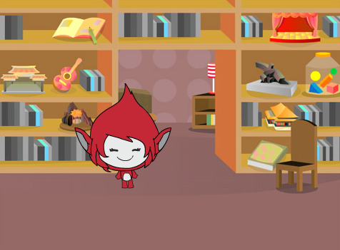
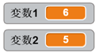

## 質問の作成

まずは適当な質問を作って、プレーヤーが答えられるようにしましょう。

+ • 新しいスクラッチのプロジェクトを開いたら、まずネコのキャラクターを消してプロジェクトをからっぽにしましょう。 オンラインのエディターはここから開きます： <a href="http://jumpto.cc/scratch-new" target="_blank">jumpto.cc/scratch-new</a>。

+ ゲームのキャラクターと背景を選びましょう。どれでも好きなものを選べます！ 例えばこんな感じです。
    
    

+ 2つの変数ボックス`変数１`{:class="blockdata"} と`変数２`{:class="blockdata"}をつくります。これらのボックスには、かけ算に使用する2つの数字が入ります。
    
    

+ 2から12までの数を変数ボックスにセットするためのコードを、作ったキャラクターに追加します。
    
    ```blocks
        ⚑ がクリックされたとき
      [number 1 v] を ((2) から (12) までの乱数) にする
      [number 2 v] を ((2) から (12) までの乱数) にする
    ```

+ プレーヤーが答を入れたら、正しいか間違いかを知らせるようにします。
    
    ```blocks
        ⚑ がクリックされたとき
    [number 1 v] を ((2) から (12) までの乱数) にする
    [number 2 v] を ((2) から (12) までの乱数) にする
    ((number 1) と ([ x ] と (number 2))) と聞いて待つ
    もし <(answer) = ((number 1) * (number 2))> なら 
      [yes! :)] と (2) 秒言う でなければ  
    [nope :(] と (2) 秒言う
    end
    ```

+ 正しい答を入れたり、わざと間違えたりして、プロジェクトをテストしてみましょう。

+ プレーヤーにたくさん質問できるように、コードに`ずっと`{:class="blockcontrol"}を加えましょう。

+ Create a countdown timer on the stage, using a variable called `time`{:class="blockdata"}. The 'Ghostbusters' project has instructions for making a timer (in step 5) if you need help!

+ Test your project again - you should be able to continue asking questions until the time runs out.