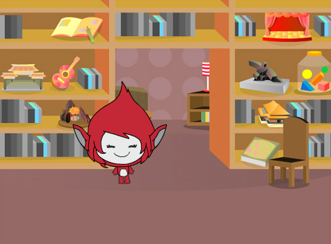
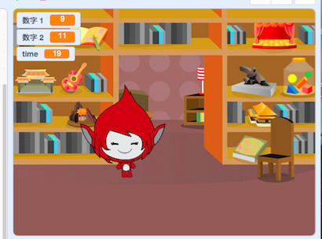

## 質問の作成

プレイヤーが答えるランダムな質問を作成することから始めます。

--- task ---

新しいスクラッチプロジェクトを開きます。

**オンライン:**新しいオンラインScratchプロジェクトを[rpf.io/scratch-new](https://rpf.io/scratch-new){:target="_blank"}で開きます。

**Offline:**オフラインエディターで新しいプロジェクトを開きます。

[rpf.io/scratchoff](https://rpf.io/scratchoff){:target="_blank"}からScratchオフラインエディタをダウンロードしてインストールできます。

--- /task ---

--- task ---

ゲームのキャラクターと背景を追加しましょう。どれでも好きなものを選べます！例えばこんな感じです。



--- /task ---

--- task ---

キャラクタースプライトが選択されていることを確認してください。 クイズの質問の数字を保存するために、 `番号 1`{:class="block3variables"}と `番号 2`{:class="block3variables"}と呼ばれる2つの新しい変数を作成します。




[[[generic-scratch3-add-variable]]]

--- /task ---

--- task ---

キャラクタースプライトにコードを追加して、二つの`変数`{:class="block3variables"} に、２から１２までの`適当な`{:class="block3operators"} 数を設定します。


```blocks3
when flag clicked
set [1番 v] to (pick random (2) to (12))
set [2番 v] to (pick random (2) to (12))
```

--- /task ---

--- task ---

`聞く`{:class="block3sensing"}にコードを追加してプレーヤーに答えを求め、そして正解か不正解かを `2秒間言います`{:class="block3looks"}。


```blocks3
when flag clicked
set [1番 v] to (pick random (2) to (12))
set [2番 v] to (pick random (2) to (12))
+ ask (join (1番)(join [ x ] (2番))) and wait
+ if <(answer) = ((1番)*(2番))> then
+ say [はい! :)] for (2) seconds
+ else
+ say [いいえ :(] for (2) seconds
+ end
```

--- /task ---

--- task ---

プロジェクトを2回テストします。１回は質問に正しく、もう１回は間違って答えます。

--- /task ---

--- task ---

プレーヤーに連続してたくさん質問をできるように、コードに`ずっと`{:class="block3control"}を加えましょう。

--- hints ---

--- hint ---

`ずっと`{:class="block3control"}ブロックを追加し、`フラグがクリックされた時`{:class="block3control"} ブロックを除くすべてのコードをそこに組入れる必要があります。

--- /hint ---

--- hint ---

必要なブロックはこちらです。

```blocks3
forever
end
```

--- /hint ---

--- hint ---

コードは次のようになります。

```blocks3
when flag clicked

+ forever
    set [1番 v] to (pick random (2) to (12))
    set [2番 v] to (pick random (2) to (12))
    ask (join (1番)(join [ x ] (2番))) and wait
    if <(answer) = ((1番)*(2番))> then
        say [はい! :)] for (2) seconds
    else
        say [いいえ :(] for (2) seconds
    end
end
```

--- /hint ---

--- /hints ---

--- /task ---