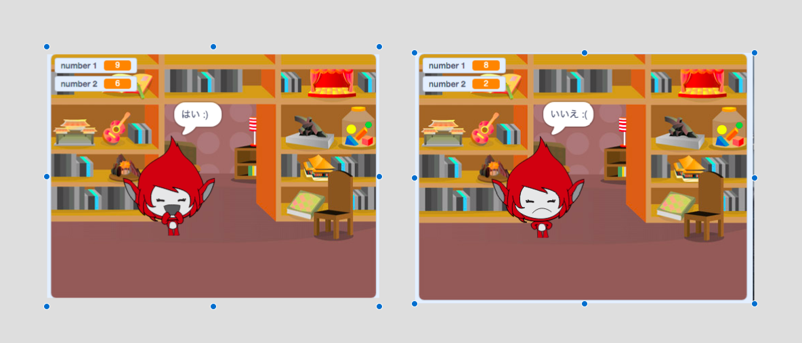

## チャレンジ：スコアとリアクションを追加

ゲームにスコアを追加できますか？

プレーヤーが正解ごとにポイントを得るようにコードを追加できます。意地悪な場合は、プレーヤーが間違った答えを出した場合にプレーヤーのスコアをゼロにリセットするコードを追加することもできます。

[[[generic-scratch3-high-score]]]

答えが正しい場合と間違っている場合とで、キャラクターのコスチュームを変えることで、キャラクターをプレーヤーの答えに反応させることができますか？

