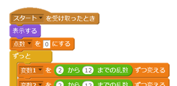
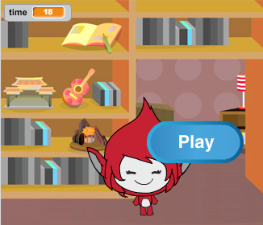
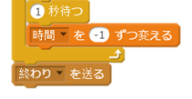
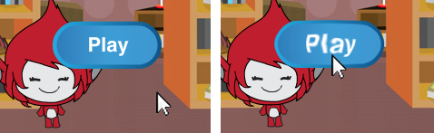

## 何回もプレーする

ゲームに「プレー」（Play）というボタンを加えて、たくさんの問題を出しましょう。

+ 「プレー」ボタンを作って、プレーヤーがクリックしたときに新しいゲームを始められるようにしましょう。自分で絵をかくことも、スクラッチでつくることもできます。
    
    

+ 新しく作ったボタンにコードを加えます。
    
    ```blocks
        ⚑ がクリックされたとき
    表示する
    
    このスプライトがクリックされたとき
    隠す
    [start v] を送る
    ```
    
    このコードを使うと、プロジェクトが始まる時に「プレー」ボタンを表示することができます。ボタンはクリックすると消えて、ゲームをスタートするメッセージを送ります。

+ メッセージを受け取ったときにゲームが始まるように、キャラクターのコードを下のように変えてください。
    
    `フラグがクリックされたとき`{:class="blockevents"} を`スタートを受け取った時`{:class="blockevents"} と取りかえてください。
    
    

+ 緑のフラグをクリックしたあと、新しく作った「プレー」ボタンをクリックしてテストしてみましょう。クリックするまでは、ゲームは始まらないはずです。

+ 緑のフラグをクリックすると、ゲームが始まっていないのにタイマーが動きだしてしまうことに気がつきましたか？
    
    
    
    この問題をなおすことはできますか？

+ `「すべて」`{:class="blockcontrol"} を止める を`「終わり」`{:class="blockevents"} を送ると取りかえてください。
    
    

+ ゲームが終わったらボタンを表示するために下のようなコードを加えてください。
    
    ```blocks
        [end v] を受け取ったとき
    表示する
    ```

+ ゲームが終わったあと、キャラクターを止めることをわすれないでください。
    
    ```blocks
        [end v] を受け取ったとき
    [スプライトの他のスクリプト v] を止める
    ```

+ 何回かゲームをして「プレー」ボタンをテストしてみましょう。 ゲームが終わったあと、「プレー」ボタンが出てくるのに気がつきましたか？ かんたんにテストができるように「時間」の数字を小さくしましょう。
    
    ```blocks
        [時 v] を [10] にする
    ```

+ マウスポインターに触れたときに、ボタンの見た目を変えることもできます。
    
    ```blocks
        ⚑ がクリックされたとき
    表示する
    ずっと 
      もし <[マウスのポインター v] に触れた> なら 
        [魚眼レンズ v] の効果を (30) にする
      でなければ
        [魚眼レンズ v] の効果を (0) にする
      end
    end
    ```
    
    