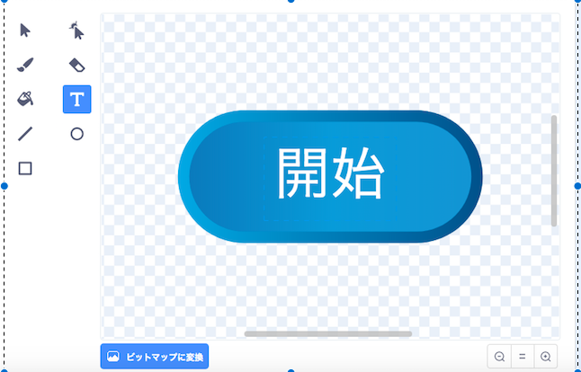
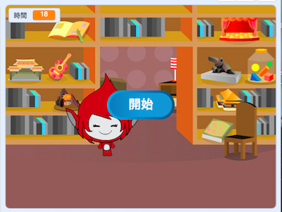
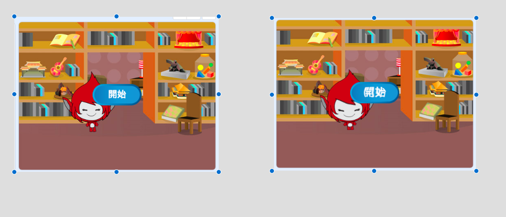

## 何回もプレーする

「再生」ボタンを追加して、プレイヤーが何度もゲームをできるようにします。

--- task ---

プレーヤーが新しいゲームを始めるためにクリックする、新しい「再生」ボタンスプライトを作成します。

自分でスプライトを描いたり、ライブラリからスプライトを編集したりできます。



--- /task ---

--- task ---

このコードをボタンスプライトに追加します。


```blocks3
    when flag clicked
    show

    when this sprite clicked
    hide
    broadcast (開始 v)
```

--- /task ---

新しいコードには別の `ブロードキャスト`{:class="block3events"} ブロックが含まれており、メッセージの '開始' を送信します。

新しいコードでは、プレイヤーが旗をクリックしたときに「開始」ボタンのスプライトが表示されます。 プレイヤーがボタンスプライトをクリックすると、スプライトは非表示になり、他のスプライトが反応できるメッセージが送信されます。

現時点では、プレイヤーが旗をクリックすると、キャラクターのスプライトが質問を始めます。 キャラクタースプライトが「開始」 `ブロードキャスト`{:class="block3events"}を受け取ったときに質問を始めるようにゲームのコードを変更します。

--- task ---

キャラクタースプライトを選択し、コードセクションで、 `旗がクリックされたとき`{:class="block3events"}ブロックを、 `開始を受信したとき`{:class="block3events"}ブロックに交換してください。


```blocks3
- when flag clicked
+ when I receive [開始 v]
set [1番 v] to (pick random (2) to (12))
set [2番 v] to (pick random (2) to (12))
ask (join (1番)(join [ x ] (2番))) and wait
if <(answer) = ((1番)*(2番))> then
    say [はい! :)] for (2) seconds
else
    say [いいえ :(] for (2) seconds
end
```

--- /task ---

--- task ---

緑の旗をクリックしてから、新しい「再生」ボタンをクリックして、動作するかどうかをテストします。ボタンをクリックする前にゲームが開始されないことがわかります。

--- /task ---

ゲームが始まったときではなく、緑の旗がクリックされたときにタイマーが始まるのがわかりますか？



--- task ---

プレーヤーがボタンをクリックしたときにタイマーが開始するように、タイマーのコードを変更できますか？

--- /task ---

--- task ---

ボタンスプライトにコードを追加すると、各ゲームの終わりにボタンが再び表示されます。


```blocks3
	when I receive [終了 v]
	show
```

--- /task ---

--- task ---

ゲームをいくつかプレイして「再生」ボタンをテストします。ボタンは各ゲームの最後に表示されます。

より速くゲームをテストするために、各ゲームがわずか数秒の長さになるように、 `時間`{:class="block3variables"}の値を変更できます。


```blocks3
	set [時間 v] to [10]
```

--- /task ---

--- task ---

マウスポインタをボタンの上に置いたときに、ボタンの見た目を変えることもできます。


```blocks3
    when flag clicked
    show
    forever
    if <touching (マウスのポインター v)?> then
        set [魚眼レンズ v] effect to (30)
    else
        set [魚眼レンズ v] effect to (0)
    end
    end
```



--- /task ---