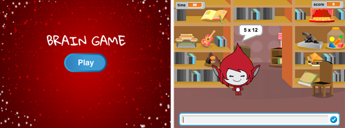

\--- challenge \---

## チャレンジ: スタート画面

別の背景をステージに入れてスタート画面を変えることはできますか？ `スタートを受け取った時`{:class="blockevents"}と`終わりを受け取った時`{:class="blockevents"}を使って背景を切りかえましょう。

下のコードのようにブロックを入れると、キャラクターやタイマーを表示したり隠したりすることができます。

```blocks
変数 [時 v] を表示する
```

```blocks
変数 [時 v] を隠す
```



\--- /challenge \---