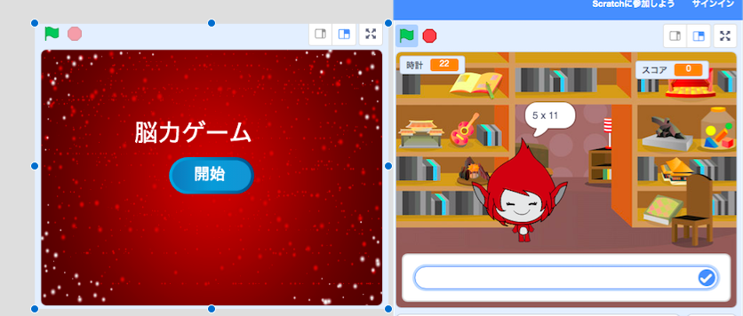

## チャレンジ：スタート画面を作成

ゲームのスタート画面になる背景を追加できますか？

`スタートを受け取ったとき`{:class="block3events"}と`終わりを受け取ったとき`{:class="block3events"}を使って背景を切りかえましょう。

ゲームの背景が切り替わったときに、キャラクターを表示または非表示にするには、 `表示`{:class="block3looks"}ブロックと、 `非表示`{:class="block3looks"} ブロックを使います。

ゲームの背景が切り替わったときに、タイマーとスコアを表示または非表示にするには、 `変数を表示`{:class="block3variables"}ブロックと、`変数を非表示`{:class="block3variables"}ブロックを使います。

