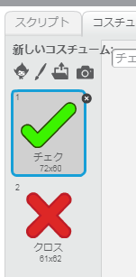
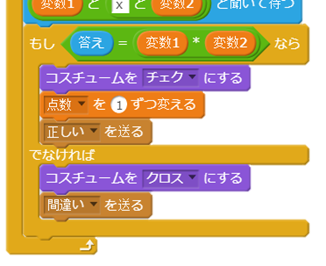
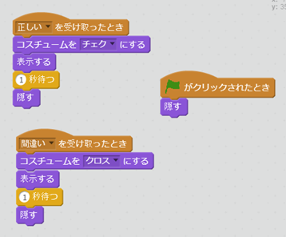
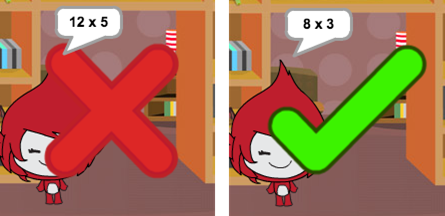
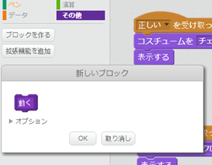
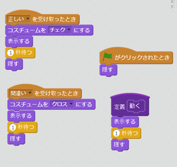

## 記号を表示する

キャラクターが`正しい`か`間違い`かを教えてくれるだけでなく、記号の絵を表示するようにしてみましょう。

+ 「結果」というスプライトを作って、「チェックマーク」（tick）と「バツ印」（cross）のコスチュームを入れてください。
    
    

+ `正しい`{:class="blockevents"}と`間違い`{:class="blockevents"}のメッセージを送るようにキャラクターのコードを下のように変えましょう。
    
    

+ メッセージで「結果」の見た目を変えられるようになりました。次のコードを「結果」に追加してください。
    
    

+ もう1回テストしてみましょう。正しい場合はチェックマークが出てきて、間違った場合はバツ印が出てくるはずです！
    
    

+ `正しいを受け取ったとき`{:class="blockevents"}と`間違いを受け取ったとき`{:class="blockevents"}のコードがほとんど同じであることに気がつきましたか？ ブロックを使ってコードをもっとかんたんに変えられるようにしましょう。
    
    「結果」のスプライトに、その他をえらんで`「ブロックを作る」`{:class="blockmoreblocks"}をクリックしてください。`動く`{:class="blockmoreblocks"}というブロックを作りましょう。
    
    

+ 動くというブロックで同じコードを2つのところで使えるようになりました。
    
    

+ 「結果」を表示するのをもっと長くしたり短くしたりしたい場合、コードを変えなければならないのは1か所だけです。やってみましょう！

+ チェックマークやバツ印を表示したり隠したりするだけではなく、アニメーションを加えてフェードインするように変えることもできます。
    
    ```blocks
        定義 (animate)
    [幽霊 v] の効果を (100) にする
    表示する
    (25) 回繰り返す 
      [幽霊 v] の効果を (-4) ずつ変える
    end
    隠す
    ```