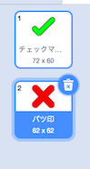
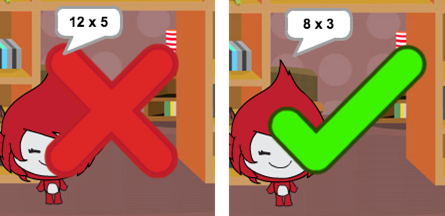
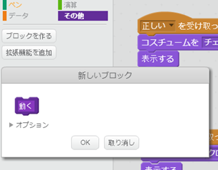
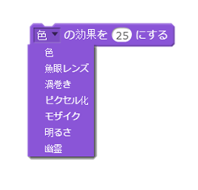

## 図の追加

現時点では、キャラクタースプライトは `はい! :)` または `いいえ :(` をプレイヤーの答えに返すだけです。 答えが正しいか正しくないかをプレイヤーに知らせるグラフィックを追加します。

--- task ---

「結果」というスプライトを作って、「チェックマーク」（tick/check）と「バツ印」（cross）のコスチュームを入れてください。



--- /task ---

--- task ---

キャラクタースプライトのコードを変更して、プレイヤーに何か言う代わりに、正解」または「不正解」のメッセージを `ブロードキャスト`{:class="block3events"} します。


```blocks3
if <(answer) = ((1番)*(2番))> then
- say [はい! :)] for (2) seconds
+ broadcast (正解 v)
else
- say [いいえ :(] for (2) seconds
+ broadcast (不正解 v)
end
```

--- /task ---

--- task ---

以上のメッセージを使って、「チェックマーク」または「バツ印」コスチュームを `表示`{:class="block3looks"} できます。次のコードを「結果」スプライトに追加します。


```blocks3
    when I receive [正解 v]
    switch costume to (チェックマーク v)
    show
    wait (1) seconds
    hide

    when I receive [不正解 v]
    switch costume to (バツ印 v)
    show
    wait (1) seconds
    hide

    when flag clicked
    hide
```

--- /task ---

--- task ---

もう1回テストしてみましょう。正しく答えた場合はチェックマークが出てきて、間違って答えた場合はバツ印が出てくるはずです！



--- /task ---

`正しいを受け取ったとき`{:class="block3events"}と`間違いを受け取ったとき`{:class="block3events"}のコードがほとんど同じであることに気がつきましたか？

したがって、コードをより簡単に変更できるように、カスタムブロックを作成します。

--- task ---

「結果」スプライトを選択します。 `ブロック定義`{:class="block3myblocks"}をクリックし、 **ブロックを作る** をクリックします。 新しいブロックを作成し、それを `アニメーション`{:class="block3myblocks"}と呼びます。




--- /task ---

--- task ---

「結果」スプライトを`表示`{:class="block3looks"}と `隠す`{:class="block3looks"} コードを`アニメーション`{:class="block3myblocks"}ブロックに移動します。


```blocks3
define animate
show
wait (1) seconds
hide
```

--- /task ---

--- task ---

`表示`{:class="block3looks"}ブロックと `隠す`{:class="block3looks"}ブロックを、**両方** の`スイッチコスチューム`{:class="block3looks"}ブロックの下から必ず削除してください。

次に、 `アニメーション`{:class="block3myblocks"}ブロックを `スイッチコスチューム`{:class="block3looks"}ブロックの下に追加します。コードは次のようになります：


```blocks3
    when I receive [正解 v]
    switch costume to (チェックマーク v)
    animate:: custom

    when I receive [不正解 v]
    switch costume to (バツ印 v)
    animate:: custom
```

--- /task ---

カスタム `アニメーション`{:class="block3myblocks"} ブロックがあるため、「結果」スプライトのコスチュームをより長くまたはより短く表示する場合は、コードに1つの変更を加えるだけで済みます。

--- task ---

「チェックマーク」または「バツ印」のコスチュームが2秒間表示されるように、コードを変更します。

--- /task ---

--- task ---

「チェックマーク」や「バツ印」を`表示`{:class="block3looks"} や`隠す`{:class="block3looks"} かわりに、`アニメーション`{:class="block3myblocks"} ブロックを変更してコスチュームをフェードインさせることができます。


```blocks3
    define animate
    set [幽霊 v] effect to (100)
    show
    repeat (25)
        change [幽霊 v] effect by (-4)
    end
    hide
```

--- /task ---

「チェックマーク」や「バツ印」の画像の動きを良くすることはできますか? コスチュームをフェードアウトさせるコードを追加したり、他のかっこよい効果を使うこともできます。

