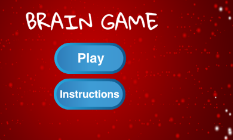

## ಸವಾಲು: ಸೂಚನಾ ಪರದೆ

ಆಟವನ್ನು ಹೇಗೆ ಆಡಬೇಕೆಂದು ಆಟಗಾರನಿಗೆ ಹೇಳುವ instructions ಪರದೆಯನ್ನು ನೀವು ಸೇರಿಸಬಹುದೇ? ಇದಕ್ಕಾಗಿ, ನಿಮಗೆ 'Instructions' button ಮತ್ತು ಇನ್ನೊಂದು ಹಂತದ ಹಿನ್ನೆಲೆ ಅಗತ್ಯವಿದೆ.



ನೀವು ಕೂಡ ಸೇರಿಸಬೇಕಾಗಬಹುದು 'Back' ಬಟನ್ ಪ್ರಾರಂಭ ಪರದೆಯತ್ತ ಹಿಂತಿರುಗಲು ಆಟಗಾರನನ್ನು ಅನುಮತಿಸುವ.

```blocks3
    broadcast (start screen v)
```