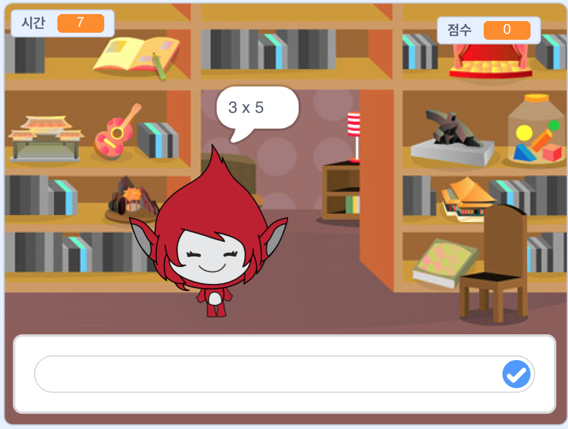

## 들어가며

이 프로젝트에서는 30초 안에 올바른 답을 얻을 수 있는 시간표 퀴즈를 만드는 방법을 배우게됩니다.

  <iframe allowtransparency="true" width="485" height="402" src="https://scratch.mit.edu/projects/embed/42225768/?autostart=false" frameborder="0"></iframe>
  

### 교육자들을 위한 추가 정보

이 프로젝트를 인쇄하려면 [프린트용 문서](https://projects.raspberrypi.org/en/projects/brain-game/print)를 사용하십시오.

## \--- 중간생략 \---

## 제목: 교육자 노트

## 소개:

이 프로젝트에서 아이들은 30초 안에 정확하게 많은 질문에 대답해야하는 times table quiz 게임을 만드는 방법을 배우게 됩니다.

## 자료

이 프로젝트에서는 Scratch 2를 사용합니다. Scratch 2는 [ jumpto.cc/scratch-on ](http://jumpto.cc/scratch-on) 에서 온라인으로 사용하거나 [ jumpto.cc/scratch-off ](http://jumpto.cc/scratch-off) 에서 다운받아서 오프라인으로 사용할 수 있습니다.

이 프로젝트의 완성 버전을 [온라인](http://scratch.mit.edu/projects/42225768/#editor)에서 확인하거나 '프로젝트 자료' 링크를 클릭하여 아래의 파일을 다운받을 수 있습니다:

* BrainGame.sb2

## 학습 목표

* 이 프로젝트는 이전에 배운 프로그래밍 기술에 대한 학습을 통합하고 방송을 사용하여 게임 메뉴 시스템을 만드는 방법을 보여줍니다.

이 프로젝트는 [라즈베리파이 디지털 메이킹 커리큘럼](http://rpf.io/curriculum) 중 다음 과정에 대한 내용을 다룹니다:

* [프로그래밍 구조를 결합하여 문제 해결하기](https://www.raspberrypi.org/curriculum/programming/builder)

## 도전과제

* "의상 변경" - 게임 캐릭터가 어떻게 보이는지 정확하고 잘못된 대답에 대한 응답 변경;
* "점수 추가하기" - 올바른 모든 질문에 대한 답에 포인트 추가;
* "시작 화면" - `시작` {:class="blockevents"} 응답으로 무대 배경 변경 그리고 `끝` {:class="blockevents"} 메세지를 방송하여 2개의 게임 '화면 만들기';
* "애니메이션 향상" - 루프 및 효과를 사용하여 올바른/ 잘못된 그래픽 애니메이션을 개선합니다;
* "소리와 음악" - 음악 루프와 음향 효과의 학습을 통합합니다;
* "10 포인트 레이스" - 새로운 게임 목표를 만들기 위해 게임 논리를 변경합니다;
* "지시 화면" - 새로운 '지시' 버튼과 화면을 추가하여 방송을 통합하여 게임 메뉴를 만듭니다.

\--- /중간생략 \---

## \--- 중간생략 \---

## 제목: 프로젝트 자료

## 교육자를 위한 자료

* [다운로드 가능한 스크래치 2 프로젝트 완성본](resources/BrainGame.sb2)
* [온라인 스크래치 2 프로젝트 완성본](http://scratch.mit.edu/projects/42225768/#editor)

\--- /중간생략 \---