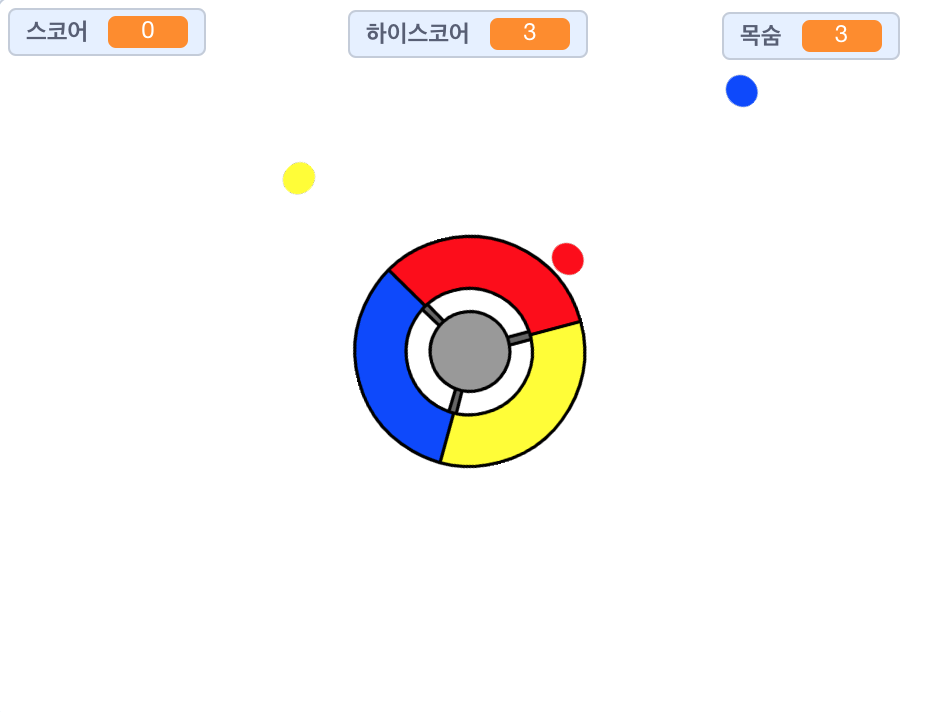

## 더 나아가기

리액샌 게임을 만드는 "점들을 잡아라"를 해보세요 이 프로젝트에서는 스프라이트의 복제본을 만드는 방법과 변수를 사용하여 점차 게임 속도를 높이는 방법을 배우게됩니다.

\--- no-print \--- 키보드의 방향키를 이용해 조종기를 조종하여 날아다니는 점들이 가운데 위치할 때 잡으세요. 만약 3개의 점을 놓치면, 게임이 끝납니다.

  <iframe allowtransparency="true" width="485" height="402" src="https://scratch.mit.edu/projects/embed/252923761/?autostart=false" frameborder="0" scrolling="no"></iframe>
  

\--- /no-print \---

\--- print-only \---  \--- /print-only \---