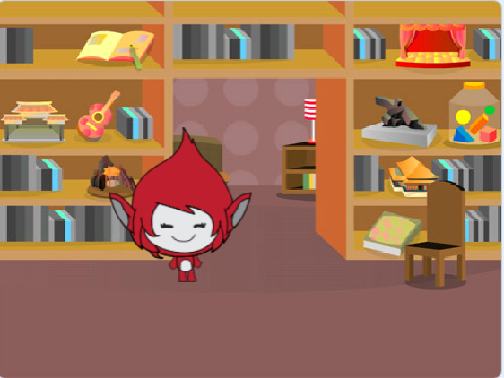
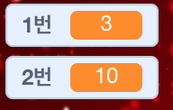

## 질문 만들기

플레이어가 대답할 수 있도록 임의의 질문을 만들어 보겠습니다.

+ 새 스크래치 프로젝트를 시작하고 프로젝트가 비어 있도록 고양이 스프라이트를 삭제하십시오. 온라인 편집기를 사용하여 새 스크래치 프로젝트를 작성하려면 <a href="http://jumpto.cc/scratch-new" target="_blank">jumpto.cc/scratch-new</a>로 이동하십시오. 

+ 게임의 캐릭터와 배경을 선택하십시오. 당신이 좋아하는 것을 선택할 수 있습니다! 다음은 그 예입니다:
    
    

+ `번호 1`{:c클래스="blockdata"} 과 `번호 2`{:c클래스="blockdata"}<0> 이라는 2 개의 새로운 변수를 만듭니다. 이 변수들은 함께 곱해질 2 개의 숫자를 저장합니다.
    
    

+ 문자에 코드를 추가하여 두 변수 모두 `무작위` {: class = "blockoperators"}에 2에서 12 사이의 숫자를 설정하십시오.
    
    ```blocks
        플래그를 클릭했을 때
        [ 1 번 v]에 (2)에서 (12)을 무작위 선택하여 설정
        [2 번 v]에 (2)에서 (12)을 무작위 선택하여 설정
    ```

+ 그런 다음에 플레이에에게 대답을 요청할 수 있으며, 그들이 옳았는지 또는 잘못되었는지를 알려줄 수 있습니다.
    
    ```blocks
        플래그를 클릭하면
        [ 1번 V] 에 (임의의 (2) ~ (12) 선택하여) 설정
        [ 2번 V] 에 (임의의 (2) ~ (12) 선택하여) 설정
        (( 1번 ) [X] ( 2번 ))) 요청하고 대기
        <(답) = (( 1번 ) * ( 2번 ))> 다음에
            [예! 말합니다. :)] (2) 초에 대하여
        else
            (2) 초에 [아니:(] 말합니다
        끝
    ```

+ 하나의 질문에 올바르게 대답하고 잘못된 대답으로 대답함으로써 프로젝트를 완전히 테스트하십시오.

+ `영원히` {: class = "blockcontrol"}를 추가하십시오. 이 코드를 반복하면 플레이어에게 많은 질문을 할 수 있습니다.

+ `시간` {: class = "blockdata"} 이라는 변수를 사용하여 스테이지에 카운트 다운 타이머 만들기 . '고스트 버스 터즈 (Ghostbusters)'프로젝트에는 도움이 필요한 경우 5 단계에서 타이머를 만들기위한 지침이 있습니다!

+ 프로젝트를 다시 테스트하십시오 - 시간이 끝날 때까지 계속 질문을 할 수 있어야합니다.