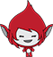

## 타이머 추가

\--- task \--- `시간`{{class = "block3variables"}이라는 새 변수를 사용하여 스테이지에 카운트 다운 타이머를 만듭니다. 타이머는 30 초에서 시작하여 0초까지 카운트다운 됩니다.


\--- hints \--- \--- hint \---

`변수`{{class = "block3variables"}}를 만들고, '시간'이라고 이름을 설정합니다. 그리고 초기값을 `30` 으로 설정합니다.

그런 다음 30 초 내에 `시간`{{class = "block3variables"}}을 0까지 카운트다운하는 코드를 제작하세요. 이렇게 하려면 매 `1` 초마다 `시간`{:class="block3variables"}을 `1` 감소하는 코드를 추가하고 무한반복합니다. 이 과정은 `시간`{:class="block3variables"} 변수가 `0`과 같을 때까지 진행합니다.

\--- /hint \--- \--- hint \--- 필요한 블록은 다음과 같습니다:

```blocks3
무한 반복 < >

끝

(1) 초 기다리기

[시간 v] 을 (1) 로 변경

(시간)

녹색 깃발이 클릭되었을 때

<() = ()>

[시간 v]를 [0]으로 설정
```

\--- /hint \--- \--- hint \--- 아래와 같이 코드를 설계할 수 있습니다: 

```blocks3
녹색 깃발을 클릭했을 때
[시간 v]를 [30] 으로 설정
 <(시간) = (0)>
    (1) 초 기다리기
    [시간 v]를 (-1) 만큼 바꾸기
끝
```

\--- /hint \--- \--- /hints \---

\--- /task \---

\--- task \---

'end'라는 메시지를 보내는 `브로드캐스트`{: class = "block3control"} 블록을 만듭니다. `브로드 캐스트`{: class = "block3control"}은 스피커를 통한 방송과 같으며 모든 스프라이트에서 들을 수 있습니다. `시간`{: class = "block3variables"}이 ` 이 경과하면 게임이 종료되도록 타이머 코드 끝에 <code>브로드 캐스트`{: class = "block3control"} 블록을 추가하십시오 0</code>.


```blocks3
    방송하기 (끝 v)
```

\--- /task \---

\--- task \--- 문자 스프라이트를 선택하고 스프라이트가 `이 <code>끝`{: class = "block3control"} 메시지를 받았을 때</code>{{class = "block3control"} 다른 스프라이트를 중지하도록 코드를 추가하십시오.



```blocks3
    [end v] 신호를 받았을 때
    멈추기 [other scripts in sprite v]
```

\--- /task \---

\--- task \---

게임을 다시 테스트하십시오. 타이머가 0으로 계산 될 때까지 질문을 계속해야합니다.

\--- /task \---