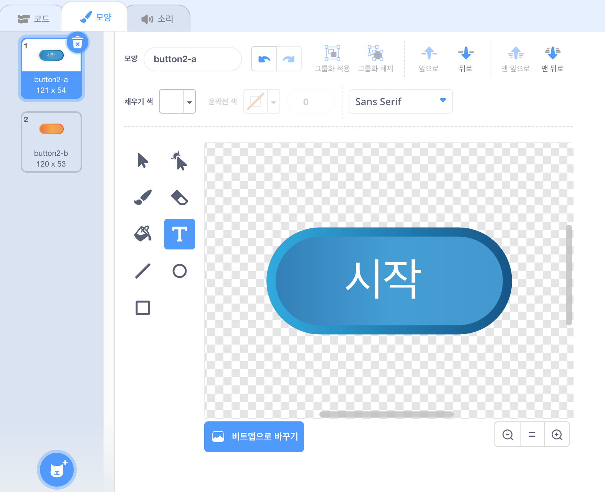
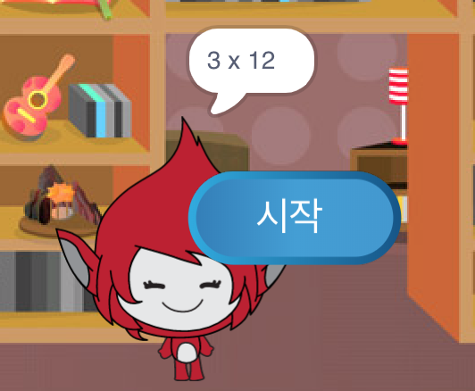

## 여러 게임

게임에 '재생'버튼을 추가하면 많은 시간을 할 수 있습니다.

+ 플레이어가 새로운 게임을 시작하기 위해 클릭하는 새로운 '재생'버튼 스프라이트를 만듭니다. 스크래치 라이브러리에서 직접 그릴 수도 있고 스프라이트를 편집 할 수도 있습니다.
    
    

+ 이 코드를 새 버튼에 추가하십시오.
    
    ```blocks
        플래그가 클릭되었을 때
        표시
    
        이 스프라이트가 클릭되었을 때
        숨기기
        브로드 캐스트 [시작 v]
    ```
    
    이 코드는 프로젝트가 시작될 때 재생 버튼을 보여줍니다. 단추를 클릭하면 숨겨진 다음 게임을 시작할 메시지를 브로드 캐스트합니다.

+ You'll need to edit your character's code, so that the game starts when they receive the `start`{:class="blockevents"} message, and not when the flag is clicked.
    
    Replace the `when flag clicked`{:class="blockevents"} code with `when I receive start`{:class="blockevents"}.
    
    

+ Click the green flag and then click your new play button to test it. You should see that the game doesn't start until the button is clicked.

+ Did you notice that the timer starts when the green flag is clicked, and not when the game starts?
    
    
    
    Can you fix this problem?

+ Click on the stage, and replace the `stop all`{:class="blockcontrol"} block with an `end`{:class="blockevents"} message.
    
    

+ You can now add code to your button, to show it again at the end of each game.
    
    ```blocks
        when I receive [end v]
        show
    ```

+ You'll also need to stop your character asking questions at the end of each game:
    
    ```blocks
        when I receive [end v]
        stop [other scripts in sprite v]
    ```

+ Test your play button by playing a couple of games. You should notice that the play button shows after each game. To make testing easier, you can shorten each game, so that it only lasts a few seconds.
    
    ```blocks
        set [time v] to [10]
    ```

+ You can even change how the button looks when the mouse hovers over it.
    
    ```blocks
        when flag clicked
        show
        forever
        if <touching [mouse-pointer v]?> then
            set [fisheye v] effect to (30)
        else
            set [fisheye v] effect to (0)
        end
        end
    ```
    
    