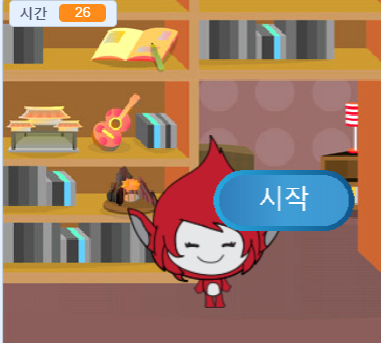

## 여러 게임

게임에 '재생'버튼을 추가하면 많은 시간을 할 수 있습니다.

+ 플레이어가 새로운 게임을 시작하기 위해 클릭하는 새로운 '재생'버튼 스프라이트를 만듭니다. 스크래치 라이브러리에서 직접 그릴 수도 있고 스프라이트를 편집 할 수도 있습니다.
    
    

+ 이 코드를 새 버튼에 추가하십시오.
    
    ```blocks
        플래그가 클릭되었을 때
        표시
    
        이 스프라이트가 클릭되었을 때
        숨기기
        브로드 캐스트 [시작 v]
    ```
    
    이 코드는 프로젝트가 시작될 때 재생 버튼을 보여줍니다. 단추를 클릭하면 숨겨진 다음 게임을 시작할 메시지를 브로드 캐스트합니다.

+ 캐릭터의 코드를 편집할 필요가 있을 때, ` 시작` {: class = "blockevents"} 메세지를 받으면 플래그가 클릭되지 않아도 게임이 시작될 수 있습니다.
    
    ` 클릭 할 때 ` {: class = "blockevents"} 코드를 ` 시작을 받았을 때 ` {: class = "blockevents"}로 대체할 수 있습니다. 
    
    

+ 녹색 플래그를 클릭 한 다음 새 재생 버튼을 클릭하여 테스트하십시오. 단추를 클릭 할 때까지 게임이 시작되지 않는 것을 확인해야합니다.

+ 게임이 시작될 때가 아니라 녹색 깃발이 클릭되었을 때 타이머가 시작된다는 것을 주의했습니까? 
    
    
    
    이 문제를 해결할 수 있습니까?

+ 무대를 클릭하고 `모든 것을 중단`{:class="blockcontrol"} 블록을 `끝`{:class="blockevents"} 메세지로 대체하시오.
    
    

+ 이제 버튼에 코드를 추가하여 각 게임이 끝날 때 코드를 다시 표시 할 수 있습니다.
    
    ```blocks
        [끝 v]을 받았을 때
        보여준다
    ```

+ 또한 각 게임의 끝에 캐릭터가 질문해야하는 것을 중지 해야 합니다.
    
    ```blocks
        [끝 v]을 받았을 때
        중지 [다른 스크립트는 스프라이트 v]
    ```

+ 몇 가지 게임을 실행하여 재생 버튼을 테스트 해보십시오. 각 게임이 끝나면 재생 버튼이 표시됩니다. 테스트를 쉽게하기 위해 각 게임을 짧게 할 수 있으므로 몇 초만 지속됩니다.
    
    ```blocks
        [시간 v]을 [10]으로 설정
    ```

+ 마우스로 가리키어 단추 모양을 변경할 수 있습니다.
    
    ```blocks
        플래그 클릭 했을 때
        표시
        영원히
        만약 <touching [mouse-pointer v]?>이라면 다음에
            [어안 V] 효과 (30) 설정
        그 밖의    
            [어안 V] 효과 (0) 설정
        끝
        끝
    ```
    
    