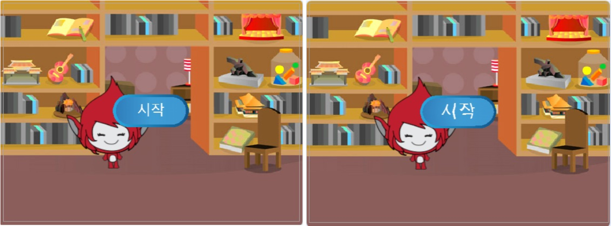

## 여러 게임

이제 플레이어가 게임을 여러 번 할 수 있도록 '재생'버튼을 추가 할 것입니다.

\--- task \---

Create a new 'Play' button sprite that the player needs to click to start a new game.

You can draw the sprite yourself, or edit a sprite from the library.


\--- /task \---

\--- task \---

Add this code to your button sprite:


```blocks3
    ⚑ 클릭했을 때
보이기

이 스프라이트를 클릭했을 때
숨기기
(start v) 신호 보내기
```

\--- /task \---

The new code includes another `broadcast`{:class="block3events"} block, which sends the message 'start'.

The new code makes the 'Play' button sprite show when when player clicks on the flag. When the player clicks on the button sprite, the sprite hides and then broadcasts a message that other sprites can react to.

At the moment, the character sprite starts asking questions when the player clicks the flag. Change your game's code so that character sprite starts asking questions when it receives the 'start' `broadcast`{:class="block3events"}.

\--- task \---

Select your character sprite and, in its code section, replace the `when flag clicked`{:class="block3events"} block with a `when I receive start`{:class="block3events"} block.


```blocks3
<br />+ [start v] 신호를 받았을 때
[number 1 v] 을\(를\) ((2) 부터 (12) 사이의 난수) 로 정하기
[number 2 v] 을\(를\) ((2) 부터 (12) 사이의 난수) 로 정하기
((number 1) 와\(과\) ([ x ] 와\(과\) (number 2) 결합하기) 결합하기) 라고 묻고 기다리기
만약 <(대답) = ((number 1) × (number 2))> \(이\)라면 
  [yes! :)] 을\(를\) (2) 초 동안 말하기
아니면 
  [nope :(] 을\(를\) (2) 초 동안 말하기
end
```

\--- /task \---

\--- task \---

Click the green flag, and then click on the new 'Play' button to test whether it works. You should see that the game doesn't start before you click on the button.

\--- /task \---

Can you see that the timer starts when the green flag is clicked, instead of when the game starts?


\--- task \---

Can you change the code for the timer so that the timer starts when the player clicks on the button?

\--- /task \---

\--- task \---

Add code to your button sprite so that the button shows again at the end of each game.


```blocks3
    [end v] 신호를 받았을 때
보이기
```

\--- /task \---

\--- task \---

Test the 'Play' button by playing a couple of games. The button should show at the end of each game.

To test the game more quickly, you can change the value of `time`{:class="block3variables"} so that each game is only a few seconds long.


```blocks3
    [시간 v]을 [10]으로 설정
```

\--- /task \---

\--- task \---

You can change how the button looks when the mouse pointer hovers over it.


```blocks3
    when flag clicked
    show
    forever
    if <touching (mouse-pointer v)?> then
        set [fisheye v] effect to (30)
    else
        set [fisheye v] effect to (0)
    end
    end
```



\--- /task \---