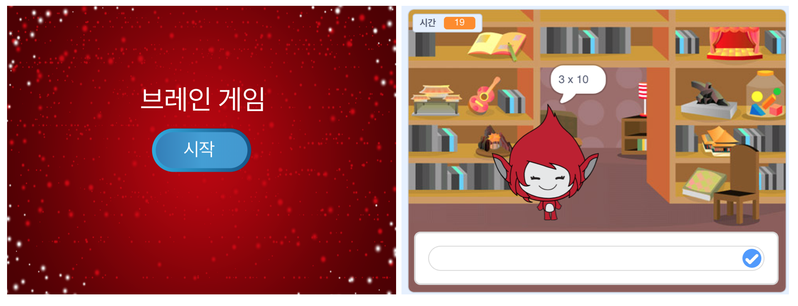

\--- 도전 \---

## 도전: 시작 화면

무대에 다른 배경을 추가 할 수 있습니까? 그러면 게임의 시작 화면이됩니다. You can use the `when I receive start`{:class="blockevents"} and `when I receive end`{:class="blockevents"} blocks to switch between backdrops.

You can also show and hide your character, and even show and hide your timer by using these blocks:

```blocks
show variable [time v]
```

```blocks
hide variable [time v]
```



\--- /challenge \---