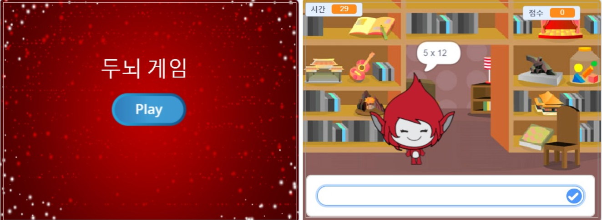

\--- 도전 \---

## 도전: 시작 화면

무대에 다른 배경을 추가 할 수 있습니까? 그러면 게임의 시작 화면이됩니다. `시작을 받을 때` {: class = "blockevents"} 그리고 `끝을 받을 때` {: class = "blockevents"} 두 개의 블록을 사용하여 배경을 전환 할 수 있습니다.

당신은 또한 당신의 캐릭터를 보여 주거나 숨길 수 있으며, 다음 블록을 사용하여 타이머를 보이거나 숨길 수도 있습니다:

```blocks
변수 표시 [시간 v]
```

```blocks
변수 숨기기 [시간 v]
```



\--- /도전 \---