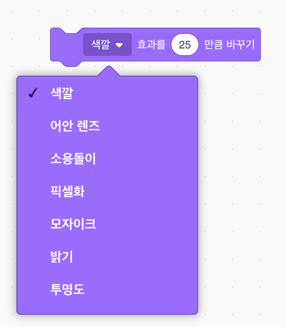

## 그래픽 추가

현재 문자 스프라이트는 `이라고 말합니다! :)` 또는 `아니오 :( 플레이어의 답변에` 플레이어에게 대답이 맞는지 틀린 지 알 수 있도록 그래픽을 추가하십시오.

\--- task \---

'Result'라는 새로운 스프라이트를 만들고 'tick / check'과 'cross'복장을하십시오.


\--- /task \---

\--- task \---

대신, 플레이어에게 무언가를 말하는, 그래서 캐릭터 스프라이트의 코드를 변경 `방송`{: 클래스 = "block3events"} 메시지 '올바른'또는 '잘못된'.


```blocks3
<(답) = ((1) * (2))> 이면

- [예! :) (2) 초 동안
+ 방송 (올바른 v)
else
- (2) 초 동안
+ 방송 (틀린 v)
끝
```

\--- /task \---

\--- task \---

이제 당신이 이러한 메시지를 사용할 수 있습니다 `쇼`{: 클래스 = "block3looks"}는 '틱'또는 '크로스'의상. '결과'스프라이트에 다음 코드를 추가합니다.


```blocks3
    내가 맞을 때 (올바른 v)
    스위치 의상을 (눈금 v)
    보여주기
    대기 (1) 초
    숨기기

    [틀린 v를 받으면]
    스위치 복장을 (십자가 v)
    쇼
    대기 (1) 초
    플래그 클릭시

    숨기기
    숨기기
```

\--- /task \---

\--- task \--- 게임을 다시 테스트하십시오. 질문에 올바르게 대답 할 때마다 진드기를보아야하며, 틀릴 때마다 십자가가 표시되어야합니다!


\--- /task \---

당신의 코드를 볼 수 `내가 올바른받을 때`: {클래스 = "block3events"}과 `내가 잘못받을 때`{: 클래스 = "block3events을"} 거의 동일합니다?

따라서 코드를 더 쉽게 변경하고 사용자 정의 블록을 생성 할 수 있습니다.

\--- task \---

'Result'스프라이트를 선택하십시오. 그런 다음 `My Blocks`{: class = "block3myblocks"}을 클릭 한 다음 **Make a Block**. 새 블록을 만들고 `animate`{: class = "block3myblocks"}이라고합니다.


\--- /task \---

\--- task \--- 코드를 `이동합니다. show`{: class = "block3looks"} 그리고 ``{: class = "block3looks"} '결과'스프라이트를 `animate`{: class = block3myblocks "} 블록 :


```blocks3
애니메이션을 정의하십시오
show
wait (1) seconds
숨기기
```

\--- /task \---

\--- 작업 \--- 당신이 제거했는지 확인 `쇼`{: 클래스 = "block3looks을"}와 `숨기기`{: 클래스 = "block3looks"} 아래 블록 **모두** 의 `스위치 의상`{: class = "block3looks"} 블록.

그런 다음 `스위치 코스튬`{: class = "block3looks"} 블록 아래에 `animate`{: class = "block3myblocks"} 블록을 추가하십시오. 이제 코드는 다음과 같이 보입니다.


```blocks3
    내가 (맞은 v)
    스위치 복장을받을 때 (눈금 v)
    animate :: custom

    [틀린 v]를받을 때
    스위치 복장 (십자가 v)
    animate :: custom
```

\--- /task \---

사용자 정의 `animate`{: class = "block3myblocks"} 블록으로 인해 'Result'스프라이트의 의상을 더 길거나 더 짧은 시간으로 표시하려면 코드를 한 번만 변경하면됩니다.

\--- task \---

'tick'또는 'cross'복장이 2 초 동안 표시되도록 코드를 변경하십시오.

\--- /task \---

\--- 작업 \--- 대신 `보여주는`: {클래스 = "block3looks"}와 `숨어`{: 클래스 = "block3looks"}는 '틱'또는 '크로스'의상을, 당신은 바꿀 수 `애니메이션을`{: class = "block3myblocks"}는 의상이 희미 해 지도록 차단합니다.


```blocks3
    애니메이션을 정의합니다
    [고스트 v] 효과를 (100)
    표시
    반복 (25)
        변경 [고스트 v] 효과로 (-4)
    끝
    숨기기
```

\--- /task \---

'진드기'또는 '십자가'그래픽의 애니메이션을 개선 할 수 있습니까? 복장을 페이드 아웃하기위한 코드를 추가하거나 다른 멋진 효과를 사용할 수 있습니다.

