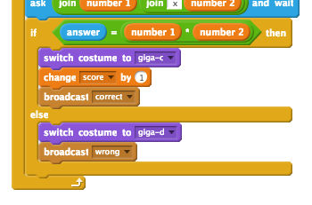

## 그래픽 추가하기

` 예! :) ` 또는 ` 없음 :( `이라고 당신의 캐릭터에게 단지 말하는 것 대신에 플레이어에게 그들이하는 일을 플레이어가 알 수 있게 해주는 그래픽을 추가합시다.

+ '체크'와 'x표'를 모두 포함하는 '결과'라는 새로운 스프라이트를 만듭니다.
    
    

+ 캐릭터의 코드를 변경하여 플레이어에게 어떻게 했는지 알려주는 것 대신에 `옳음` {: class = "blockevents"} 및 `틀림` {: class = "blockevents"} 메시지를 보내주십시오.
    
    

+ 이제 메시지를 사용하여 '체크'또는 'x표'를 표시 할 수 있습니다. 이 코드를 새 '결과'스프라이트에 추가하십시오.
    
    

+ 게임을 다시 테스트 해보십시오. 정확한 질문을 할 때마다 체크가 보일 것이며, 잘못 될 때마다 x표가 보일 것입니다.
    
    

+ `내가 옳음을 받았을 때`{:class="blockevents"} 와 `내가 틀림을 받았을 때`{:class="blockevents"}의 코드는 거의 동일합니까? 코드를 더 쉽게 변경할 수있는 함수를 만들어 보겠습니다.
    
    '결과'스프라이트에서 `추가 블록` {: class = "blockmoreblocks"}, 그리고 나서 'Make a Block'을 선택하십시오. ` animate` {: class = "blockmoreblocks"} 라는 새로운 함수를 만듭니다. 
    
    

+ 그런 다음 새 애니메이션 함수에 애니메이션 코드를 추가 한 다음이 함수를 두 번 사용할 수 있습니다.
    
    

+ 이제 체크와 x표를 길게 또는 짧게 표시하려면 코드를 한 번만 변경하면됩니다. 시도 해보십시오!

+ 체크와 x표 표시만 보이고 숨기는 대신 그래픽 기능이 사라지도록 애니메이션 기능을 변경할 수 있습니다.
    
    ```blocks
        define [animate]
        set [ghost v] effect to (100)
        show
        repeat (25)
            change [ghost v] effect by (-4)
        end
        hide
    ```