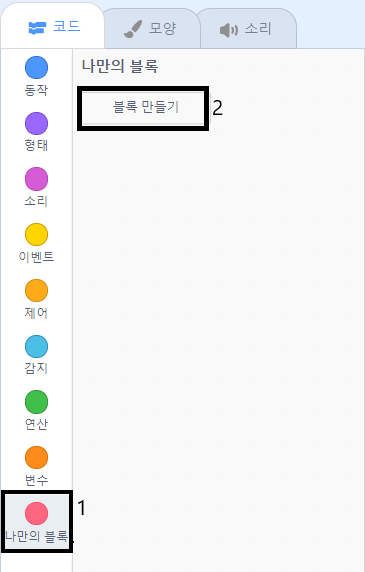

## 그래픽 추가

현재 문자 스프라이트는 단순히 `맞습니다! :) ` 혹은 `틀립니다! :( ` 만 말합니다. 여기에 그래픽을 추가하여 정답이 맞는지 틀린지 시각적으로 표현하세요.

\--- task \---

'체크'와 'x표'를 모두 포함하는 '결과'라는 새로운 스프라이트를 만듭니다.


\--- /task \---

\--- task \---

캐릭터 스프라이트의 코드를 변경하여, '맞음' 과 '틀림' 신호를 `방송하기`{:class="block3events"}할 수 있도록 하세요.


```blocks3
만약 <(답) = ((1번) × (2번))> \(이\)라면 
  [맞습니다! :)] 을\(를\) (2) 초 동안 말하기
  + (맞음 v) 신호 보내기
아니면 
  [틀립니다 :(] 을\(를\) (2) 초 동안 말하기
  + (틀림 v) 신호 보내기
end
```

\--- /task \---

\--- task \---

이제 `show`{:class="block3looks"} 메시지를 사용하여 '체크' 또는 'x표' 의상을 표시할 수 있습니다. 결과 스프라이트에 다음 코드를 추가하세요.


```blocks3
    [맞음 v] 신호를 받았을 때
모양을 (체크 v) \(으\)로 바꾸기
보이기
(1) 초 기다리기
숨기기

[틀림 v] 신호를 받았을 때
모양을 (x표 v) \(으\)로 바꾸기
보이기
(1) 초 기다리기
숨기기

⚑ 클릭했을 때
숨기기
```

\--- /task \---

\--- task \---

Test your game again. You should see the tick whenever you answer a question correctly, and the cross whenever you answer incorrectly!


\--- /task \---

Can you see that the code for `when I receive correct`{:class="block3events"} and `when I receive wrong`{:class="block3events"} is nearly identical?

So you can change your code more easily, you are going to create a custom block.

\--- task \---

Select the 'Result' sprite. Then click on `My Blocks`{:class="block3myblocks"}, and then on **Make a Block**. Create a new block and call it `animate`{:class="block3myblocks"}.




\--- /task \---

\--- task \---

Move the code to `show`{:class="block3looks"} and `hide`{:class="block3looks"} the 'Result' sprite into the `animate`{:class="block3myblocks"} block:


```blocks3
애니메이션 정의하기
보이기
(1) 초 기다리기
숨기기
```

\--- /task \---

\--- task \---

Make sure you have removed the `show`{:class="block3looks"} and `hide`{:class="block3looks"} blocks below **both** of the `switch costume`{:class="block3looks"} blocks.

Then add the `animate`{:class="block3myblocks"} block below both of the `switch costume`{:class="block3looks"} blocks. Your code should now look like this:


```blocks3
    [correct v] 신호를 받았을 때
모양을 (체크 v) \(으\)로 바꾸기
animate :: custom

[wrong v] 신호를 받았을 때
모양을 (x표 v) \(으\)로 바꾸기
animate :: custom
```

\--- /task \---

Because of the custom `animate`{:class="block3myblocks"} block, you now only need to make one change to your code if you want to show the 'Result' sprite's costumes a longer or shorter time.

\--- task \---

Change your code so that the 'tick' or 'cross' costumes display for 2 seconds.

\--- /task \---

\--- task \---

Instead of `showing`{:class="block3looks"} and `hiding`{:class="block3looks"} the 'tick' or 'cross' costumes, you could change your `animate`{:class="block3myblocks"} block so that the costumes fade in.


```blocks3
    정의하기 animate
[ghost v] 효과를 (100) 로 정하기
보이기
(25) 번 반복하기 
  [ghost v] 효과를 (-4) 만큼 바꾸기
end
숨기기
```

\--- /task \---

Can you improve the animation of the 'tick' or 'cross' graphics? You could add code to make the costumes fade out as well, or you could use other cool effects:

