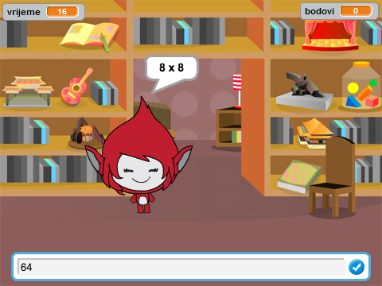

## Uvod

U ovom projektu ćeš naučiti kako da napraviš kviz sa pitanjima iz tablice množenja u kojem treba da tačno odgovoriš na što više pitanja u 30 sekundi.

  <iframe allowtransparency="true" width="485" height="402" src="https://scratch.mit.edu/projects/embed/42225768/?autostart=false" frameborder="0"></iframe>
  

### Dodatne informacije za vođe kluba

Ukoliko je potrebno da odštampate ovaj projekat, koristite [Verziju za štampu](https://projects.raspberrypi.org/en/projects/brain-game/print).

## \--- collapse \---

## title: Bilješke za vođe kluba

## Uvod:

U ovom projektu djeca će naučiti kako da naprave kviz sa pitanjima iz tablice množenja u kojem igrač treba da tačno odgovori na što više pitanja u 30 sekundi.

## Izvori

Za ovaj projekat koristite Scratch 2. Scratch 2 možete koristiti online na [jumpto.cc/scratch-on](http://jumpto.cc/scratch-on) ili ga preuzeti sa [jumpto.cc/scratch-off](http://jumpto.cc/scratch-off) i koristiti offline.

Završenu verziju projekta možete naći [online](http://scratch.mit.edu/projects/42225768/#editor) ili preuzeti klikom na link 'Project Materials', koji sadrži:

* BrainGame.sb2

## Ciljevi učenja

* U ovom projektu utvrđuju se prethodno savladane vještine programiranja i pokazuje kako se slanje poruka može koristiti za izradu jednostavnog sistema menija igre.

Ovim projektom obuhvaćeni su elementi iz sljedećih dijelova [Raspberry Pi Digital Making Curriculum](http://rpf.io/curriculum):

* [Kombinujte programske konstrukcije za rješavanje problema.](https://www.raspberrypi.org/curriculum/programming/builder)

## Izazovi

* ''Promjena kostima'' - promjena izgleda karaktera u skladu sa tačnim ili netačnim odgovorom;
* ''Dodavanje bodova'' - dodavanje boda za svaki tačan odgovor;
* ''Početni ekran'' - promjena pozadine pozornice kao odgovor na poruke `kreni`{:class="blockevents"} i `kraj`{:class="blockevents"}, kreiranje 2 'ekrana' igre;
* ''Poboljšana animacija'' - korišćenje petlji i efekata za poboljšanje animacije grafika tačno/netačno;
* ''Zvuk i muzika'' - utvrđivanje znanja o muzičkim petljama i zvučnim efektima;
* ''Trka do 10 bodova'' - promjena logike igre za kreiranje novog cilja igre;
* ''Ekran sa uputstvima'' - utvrđivanje znanja o korišćenju poruka za kreiranje menija igre, dodavanjem novog dugmeta 'uputstva' i ekrana.

\--- /collapse \---

## \--- collapse \---

## title: Projektni materijali

## Izvori za vođe kluba

* [Završen Scratch 2 projekat koji se može preuzeti](resources/BrainGame.sb2)
* [Završen Scratch 2 projekat online](http://scratch.mit.edu/projects/42225768/#editor)

\--- /collapse \---