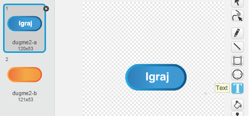
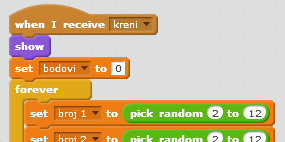
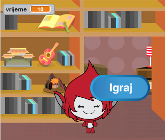
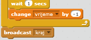
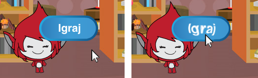

## Više igara

Hajde da u tvoju igru dodamo dugme 'igraj', tako da možeš da je igraš više puta.

+ Kreiraj novi lik (sprite) dugmeta 'Igraj' na koji će tvoj igrač kliknuti kako bi započeo novu igru. Možeš sam/sama da ga nacrtaš ili da urediš lik iz Scratch biblioteke (library).
    
    

+ Dodaj sljedeći kôd svom novom dugmetu.
    
    ```blocks
        when flag clicked
        show
    
        when this sprite clicked
        hide
        broadcast [igraj v]
    ```
    
    Ovaj kôd prikazuje dugme 'igraj' kada se započne projekat. Kada se klikne na dugme, ono se sakrije i, nakon toga, šalje poruku koja će započeti igru.

+ Biće potrebno da promijeniš kôd svog karaktera tako da igra počne kada karakter dobije poruku `kreni`{:class="blockevents"}, a ne kada se klikne na zastavicu.
    
    Zamijeni kôd `when flag clicked`{:class="blockevents"} (kada se klikne na zastavicu) sa `when I receive start`{:class="blockevents"} (kada primim kreni).
    
    

+ Klikni na zelenu zastavicu, a zatim na novo dugme 'Igraj' da ga isprobaš. Trebalo bi da vidiš da igra ne počinje sve dok se ne pritisne dugme.

+ Da li primjećuješ da brojač vremena počinje da odbrojava kada se klikne na zelenu zastavicu, a ne kada igra počne?
    
    
    
    Možeš li to da popraviš?

+ Klikni na pozornicu (stage) i zamijeni blok `stop all`{:class="blockcontrol"} (zaustavi sve) porukom `kraj`{:class="blockevents"}.
    
    

+ Sada možeš da dodaš kôd svom dugmetu kako bi se ono ponovo pojavilo na kraju svake igre.
    
    ```blocks
        when I receive [kraj v]
        show
    ```

+ You'll also need to stop your character asking questions at the end of each game:
    
    ```blocks
        when I receive [end v]
        stop [other scripts in sprite v]
    ```

+ Test your play button by playing a couple of games. You should notice that the play button shows after each game. To make testing easier, you can shorten each game, so that it only lasts a few seconds.
    
    ```blocks
        set [time v] to [10]
    ```

+ You can even change how the button looks when the mouse hovers over it.
    
    ```blocks
        when flag clicked
        show
        forever
        if <touching [mouse-pointer v]?> then
            set [fisheye v] effect to (30)
        else
            set [fisheye v] effect to (0)
        end
        end
    ```
    
    