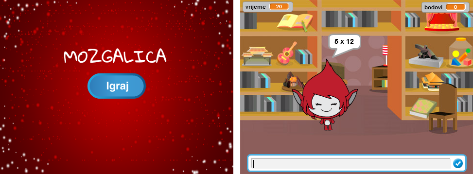

\--- challenge \---

## Izazov: Početni ekran

Da li možeš na pozornicu da dodaš još jednu pozadinu (backdrop) koja će biti početni ekran tvoje igre? You can use the `when I receive start`{:class="blockevents"} and `when I receive end`{:class="blockevents"} blocks to switch between backdrops.

You can also show and hide your character, and even show and hide your timer by using these blocks:

```blocks
show variable [time v]
```

```blocks
hide variable [time v]
```



\--- /challenge \---