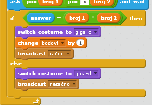
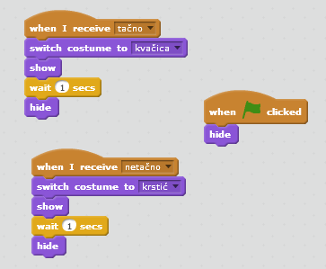
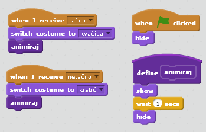

## Dodavanje grafika

Umjesto da tvoj karakter igraču samo govori `da! :)` ili `ne :(`, dodajmo i nekoliko grafika koje će igraču pokazivati kako mu ide.

+ Izradi novi lik (sprite), pod nazivom 'Rezultat', koji ima dva kostima (costumes) - 'kvačicu' i 'krstić'.
    
    

+ Izmijeni kôd svog karaktera tako da, umjesto da govori igraču kako je odgovorio, šalje poruke `tačno`{:class="blockevents"} i `netačno`{:class="blockevents"}.
    
    

+ Sada možeš upotrijebiti ove poruke za prikazivanje kostima 'kvačica' ili 'krstić'. Dodaj sljedeći kôd svom novom liku 'Rezultat':
    
    

+ Isprobaj ponovo svoju igru. Trebalo bi da vidiš kvačicu svaki put kada je odgovor tačan, a krstić svaki put kada je netačan!
    
    

+ Da li primjećuješ da su kôdovi za `when I receive tačno`{:class="blockevents"} i `when I receive netačno`{:class="blockevents"} gotovo identični? Kreirajmo funkciju koja će ti olakšati da napraviš izmjene u svom kôdu.
    
    U svom liku 'Rezultat', klikni na `More Blocks`{:class="blockmoreblocks"} (Više blokova), a zatim klikni na 'Make a Block' (Napravi blok). Kreiraj novu funkciju i nazovi je `animiraj`{:class="blockmoreblocks"}.
    
    

+ Nakon toga, možeš da dodaš kôd za animaciju u svoju novu funkciju za animaciju, a zatim samo da je upotrijebiš dva puta:
    
    

+ Sada, ako želiš da prikazuješ kvačicu i krstić duže ili kraće vrijeme, potrebno je da napraviš samo jednu izmjenu u svom kôdu. Pokušaj!

+ Umjesto da se kružić i kvačica samo prikazuju i nestaju, možeš promijeniti funkciju za animaciju tako da grafike postepeno nestaju.
    
    ```blocks
        define [animiraj]
        set [ghost v] effect to (100)
        show
        repeat (25)
            change [ghost v] effect by (-4)
        end
        hide
    ```