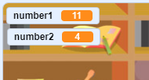

## प्रश्न तयार करा

आपण प्रारंभ करणार आहात यादृच्छिक प्रश्न निर्माण करून ज्याचे खेळाडूला उत्तर द्यावे लागेल.

--- task ---

एक नवीन रिक्त Scratch प्रकल्प उघडा.

**ऑनलाईन:** [rpf.io/scratch-new](https//rpf.io/scratch-new){:target="_blank"} वर एक नवीन ऑनलाइन स्क्रॅच प्रकल्प उघडा.

**ऑफलाइन:** ऑफलाइन संपादकात एक नवीन प्रकल्प उघडा.

आपल्याला Scratch ऑफलाइन संपादक डाउनलोड आणि स्थापित करणे आवश्यक असल्यास, आपण ते [rpf.io/scratchoff](https//rpf.io/scratchoff){:target="_blank"} येथे शोधू शकता.

--- /task ---

--- task ---

तुमच्या खेळासाठी पात्र sprite आणि पार्श्वभूमी जोडा. तुम्ही तुमच्या आवडीनुसार निवडू शकता! येथे एक उदाहरण आहे:


--- /task ---

--- task ---

खात्री करा तुमच्याकडे तुमचे पात्र sprite निवडलेला आहे. २ नवीन चल तयार करा, ज्याला म्हणतात `number1`{:class="block3variables"} आणि `number2`{:class="block3variables"}, प्रश्नोत्तरी प्रश्नांसाठी संख्या साठवण्या साठी.




[[[generic-scratch3-add-variable]]]

--- /task ---

--- task ---

तुमच्या चारक्टर स्प्राइट मध्ये कोड जोडा दोन्ही सेट करण्यासाठी `variables`{:class="block3variables"}एका `random`{:class="block3operators"} मध्ये क्रमांक २ आणखी १२ च्या मध्ये.


```blocks3
when flag clicked
set [number 1 v] to (pick random (2) to (12))
set [number 2 v] to (pick random (2) to (12))
```

--- /task ---

--- task ---

कोड जोडा `ask`{:class="block3sensing"} खेळाडू उत्तरासाठी, आणि मग `say for 2 seconds`{:class="block3looks"} उत्तर बरोबर होते कि चूकः:


```blocks3
when flag clicked
set [number 1 v] to (pick random (2) to (12))
set [number 2 v] to (pick random (2) to (12))
+ ask (join (number 1)(join [ x ] (number 2))) and wait
+ if <(answer) = ((number 1)*(number 2))> then
+ say [yes! :)] for (2) seconds
+ else
+ say [no :(] for (2) seconds
+ end
```

--- /task ---

--- task ---

तुमच्या प्रकल्पाची दोनदा चाचणी करा: एका प्रश्नाचे योग्य उत्तर द्या, आणि इतर चुकीच्या पद्धतीने.

--- /task ---

--- task ---

एक `forever`{:class="block3control"}पळवाट जोडा या कोडच्या आसपास, जेणेकरून खेळ खेळाडूला एकापाठोपाठ बरेच प्रश्न विचारले.

--- hints ---


--- hint ---

तुम्हाला एक `forever`{:class="block3control"} ब्लॉक जोडायची आवश्यकता आहे, आपण सर्व कोड ठेवले वगळता `when flag clicked`{:class="block3control"} ब्लॉक त्यात.

--- /hint ---

--- hint ---

तुम्हाला आवश्यक असलेला ब्लॉक येथे आहे:

```blocks3
forever
end
```

--- /hint ---

--- hint ---

तुमचा कोड कसा दिसला पाहिजे ते येथे आहे:

```blocks3
when flag clicked
+ forever
    set [number 1 v] to (pick random (2) to (12))
    set [number 2 v] to (pick random (2) to (12))
    ask (join (number 1)(join [ x ] (number 2))) and wait
    if <(answer) = ((number 1)*(number 2))> then
        say [yes! :)] for (2) seconds
    else
        say [no :(] for (2) seconds
    end
end
```

--- /hint ---

--- /hints ---

--- /task ---
