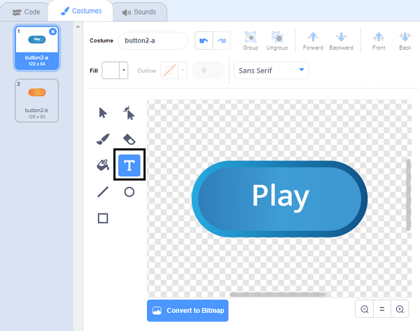

## अनेक खेळ

तुम्ही आता एक 'Play' बटण जोडाल ज्याणेंकरुन खेळाडू बर्‍याच वेळा खेळ खेळू शकतो.

--- task ---

एक नवीन 'प्ले' बटण sprite तयार करा जे खेळाडूला क्लिक करण्याची आवश्यकता आहे एक नवीन खेळ प्रारंभ करण्याकरिता.

तुम्ही स्वतः sprite बनवू शकता, किंवा ग्रंथालयातून sprite संपादित करु शकता.



--- /task ---

--- task ---

हा कोड तुमच्या बटण sprite मध्ये जोडा:


```blocks3
    when flag clicked
    show

    when this sprite clicked
    hide
    broadcast (start v)
```

--- /task ---

नवीन कोडमध्ये आणखी एक समाविष्ट आहे `broadcast`{:class="block3events"} ब्लॉक, जो 'प्रारंभ' हा संदेश पाठवतो.

जेव्हा प्लेअर ध्वज क्लिक करतात तेव्हा नवीन कोड 'प्ले' बटण spझेंड्यावरrite शो बनवतो. जेव्हा खेळाडू sprite बटण वर क्लिक करतो, sprite लपून जातो आणि नंतर इतर sprites प्रतिक्रिया देऊ शकतील असा संदेश प्रसारित केल्या जातो.

या क्षणी, जेव्हा खेळाडू ध्वज क्लिक करतो तेव्हा वर्ण sprite प्रश्न विचारण्यास सुरवात करतो. तुमच्या खेळाचा कोड बदला ज्याणेंकरुन वर्ण स्प्राइट प्रश्न विचारायला लागतो जेव्हा तो 'प्रारंभ' `broadcast`{:class="block3events"} हा संदेश प्राप्त करतो.

--- task ---

तुमचा वर्ण sprite निवडा आणि, त्याच्या कोड विभागात `when flag clicked`{:class="block3events"} ब्लॉकला पुनर्स्थित करा `when I receive start`{:class="block3events"} ब्लॉक सह.


```blocks3
- when flag clicked
+ when I receive [start v]
set [number 1 v] to (pick random (2) to (12))
set [number 2 v] to (pick random (2) to (12))
ask (join (number 1)(join [ x ] (number 2))) and wait
if <(answer) = ((number 1)*(number 2))> then
    say [yes! :)] for (2) seconds
else
    say [nope :(] for (2) seconds
end
```

--- /task ---

--- task ---

Green ध्वज वर क्लिक करा, आणि मग नवीन 'प्ले' बटणवर क्लिक करा ते कार्य करते की नाही हे तपासण्यासाठी. तुम्ही बटणवर क्लिक करण्यापूर्वी हा खेळ सुरु होत नाही हे तुम्ही पाहिले पाहिजे.

--- /task ---

खेळ सुरु होण्याऐवजी green ध्वज क्लिक केल्यावर टाइमर सुरु होताना तुम्ही पाहू ध्वज क्लिशकता का?


--- task ---

तुम्ही टीमेरकरिता कोड बदलू शकता का ज्याणेंकरून टाइमर प्रारंभ होतो जेव्हा खेळाडू बटण वर क्लिक करतो?

--- /task ---

--- task ---

तुमच्या बटण sprite कोड जोडा ज्याणेंकरून प्रत्येक खेळाची शेवटी बटण पुन्हा दिसून येईल.


```blocks3
    when I receive [end v]
    show
```

--- /task ---

--- task ---

दोन खेळ खेळून 'प्ले' बटणाची चाचणी करा. प्रत्येक खेळाच्या शेवटी बटण दर्शविले पाहिजे.

खेळाची अधिक त्वरीत चाचणी करण्यासाठी तुम्ही `time`{:class="block3variables"} ची मूल्य बदलू शकता जेणेकरून प्रत्येक खेळ काही सेकंदांचा असेल.


```blocks3
    set [time v] to [10]
```

--- /task ---

--- task ---

जेव्हा माउस पॉईंटर त्यावर फिरतो तेव्हा तुम्ही बटण कसे दिसते ते बदलू शकता.


```blocks3
    when flag clicked
    show
    forever
    if <touching (mouse-pointer v)?> then
        set [fisheye v] effect to (30)
    else
        set [fisheye v] effect to (0)
    end
    end
```


--- /task ---