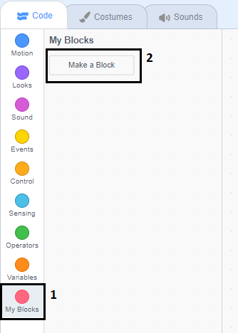

## ग्राफिक्स जोडा

या क्षणी, वर्ण sprite फक्त म्हणतो `yes! :)` किंवा `no :(` खेळाडू च्या उत्तराला. खेळाडूचे उत्तर बरोबर आहे की चूक आहे हे कळविण्यासाठी काही ग्राफिक्स जोडा.

--- task ---

'परिणाम' नावाचा एक नवीन sprite तयार करा, आणि त्यास 'टिक / चेक' आणि 'क्रॉस' पोशाख द्या.


--- /task ---

--- task ---

तुमच्या पात्र sprite चा कोड बदला जेणेकरून,खेळाडूला काहीतरी बोलण्याऐवजी ते `broadcasts`{:class="block3events"}संदेश 'बरोबर' किंवा 'चुकीचे'.


```blocks3
if <(answer) = ((number 1)*(number 2))> then
- say [yes! :)] for (2) seconds
+ broadcast (correct v)
else
- say [nope :(] for (2) seconds
+ broadcast (wrong v)
end
```

--- /task ---

--- task ---

आता तुम्ही हे संदेश वापरू शकता `show`{:class="block3looks"} 'टिक' किंवा 'क्रॉस' पोशाख. 'निकाल' sprite मध्ये पुढील कोड जोडा:


```blocks3
    when I receive [correct v]
    switch costume to (tick v)
    show
    wait (1) seconds
    hide

    when I receive [wrong v]
    switch costume to (cross v)
    show
    wait (1) seconds
    hide

    when flag clicked
    hide
```

--- /task ---

--- task ---

तुमच्या खेळाची पुन्हा चाचणी करा. तुम्ही जेव्हा जेव्हा एखाद्या प्रश्नाचे योग्य उत्तर देता तेव्हा आपण टिक पहावे. आणि जेव्हा तुम्ही चुकीचे उत्तर देता तेव्हा क्रॉस!


--- /task ---

तुम्ही तो कोड पाहू शकता का `when I receive correct`{:class="block3events"} साठी आणि `when I receive wrong`{:class="block3events"} जवळपास एकसारखे आहे?

तर तुम्ही तुमचा कोड अधिक सहजपणे बदलू शकता, तुम्ही एक सानुकूल ब्लॉक तयार करणार आहात.

--- task ---

'निकाल' sprite निवडा. त्यानंतर `My Blocks`{:class="block3myblocks"} वर क्लिक करा, आणि नंतर **Make a Block** वर. एक नवीन ब्लॉक तयार करा आणि `animate`{:class="block3myblocks"} त्याला म्हणू.




--- /task ---

--- task ---

कोड `show`{:class="block3looks"} येथे हलवा आणि `hide`{:class="block3looks"} 'निकाल' स्प्राइट `animate`{:class="block3myblocks"} ब्लॉक मध्ये:


```blocks3
define animate
show
wait (1) seconds
hide
```

--- /task ---

--- task ---

तुम्ही `show`{:class="block3looks"} काढले असल्याची खात्री घ्या आणि `hide`{:class="block3looks"} ब्लॉक्स खाली **both** या `switch costume`{:class="block3looks"} ब्लॉक्स.

नंतर जोडा `animate`{:class="block3myblocks"} ब्लॉक दोन्ही `switch costume`{:class="block3looks"} ब्लॉकसच्या खाली. तुमचा कोड आता यासारखा दिसला पाहिजे:


```blocks3
    when I receive [correct v]
    switch costume to (tick v)
    animate:: custom

    when I receive [wrong v]
    switch costume to (cross v)
    animate:: custom
```

--- /task ---

प्रथामुळे `animate`{:class="block3myblocks"} ब्लॉक, तुम्हाला फक्त तुमचा कोड बदलण्याची आवश्यकता आहे जर तुम्हाला 'निकाल' sprite चा पोशाखांना जास्त किंवा कमी कालावधी साठी दर्शवायचे असेल.

--- task ---

तुमचा कोड बदला जेणेकरून 'टिक' किंवा 'क्रॉस' पोशाख 2 सेकंदांसाठी प्रदर्शित होतील.

--- /task ---

--- task ---

`showing`{:class="block3looks"} त्याऐवजी आणि `hiding`{:class="block3looks"} 'टिक' किंवा 'क्रॉस' पोशाख, तुम्ही तुमचे `animate`{:class="block3myblocks"} ब्लॉक बदलू शकता जेणेकरून पोशाख ढासळतील.


```blocks3
    define animate
    set [ghost v] effect to (100)
    show
    repeat (25)
        change [ghost v] effect by (-4)
    end
    hide
```

--- /task ---

तुम्ही 'टिक' किंवा 'क्रॉस' ग्राफिक्सचे अ‍ॅनिमेशन सुधारू शकता? पोशाख तसेच संपू देण्यासाठी तुम्ही कोड जोडू शकता किंवा तुम्ही इतर मस्त प्रभाव वापरू शकता:

