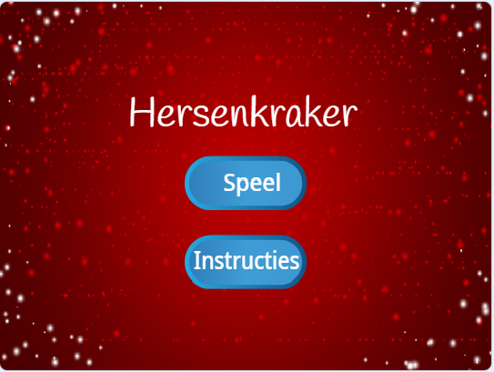

\--- challenge \---

## Uitdaging: Instructie scherm

Kun je een instructiescherm aan je spel toevoegen en je speler vertellen hoe het spel moet worden gespeeld? U hebt een knop 'Instructies' en een achtergrond van het speelveld.



Je hebt misschien ook een 'Terug' knop nodig om je naar het hoofdmenu te brengen.

```blocks
    broadcast [main menu v]
```

\--- /challenge \---