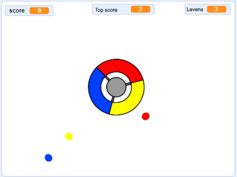

## Wat nu?

Probeer het [Vang de stippen](https://projects.raspberrypi.org/en/projects/catch-the-dots?utm_source=pathway&utm_medium=whatnext&utm_campaign=projects) project om een reactiespel te maken! In dat project ga je leren hoe je klonen van sprites maakt en hoe je een variabele gebruikt om het spel geleidelijk te versnellen.

\--- no-print \--- Gebruik de pijltjestoetsen op je toetsenbord om het controlewiel te draaien en vang de vliegende stippen als ze het midden bereiken. Als je drie stippen mist is het spel afgelopen.

  <iframe allowtransparency="true" width="485" height="402" src="https://scratch.mit.edu/projects/embed/252923761/?autostart=false" frameborder="0" scrolling="no"></iframe>
  

\--- /no-print \---

\--- print-only \---  \--- /print-only \---