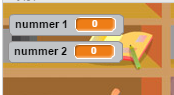

## Vragen maken

Laten we beginnen met het maken van willekeurige vragen die de speler moet beantwoorden.

+ Start een nieuw Scratch-project en verwijder de cat-sprite zodat uw project leeg is. Je kunt de online Scratch-editor vinden op <a href="http://jumpto.cc/scratch-new" target="_blank"> jumpto.cc/scratch-new </a>.

+ Kies een personage en een achtergrond voor je spel. Je kunt kiezen wat je wilt! Hier is een voorbeeld:
    
    

+ Maak 2 nieuwe variabelen met de naam ` nummer 1 ` {: class = "blockdata"} en ` nummer 2 ` {: Class = "blockdata"}. Deze variabelen slaan de 2 nummers op die samen worden vermenigvuldigd.
    
    

+ Voeg code toe aan uw karakter, om beide variabelen willekeurig in te stellen op ` ` {: class = "blockoperators"} een getal tussen 2 en 12.
    
    ```blocks
    wanneer ⚑ wordt aangeklikt
maak [nummer 1 v] (willekeurig getal tussen (2) en (12))
maak [nummer 2 v] (willekeurig getal tussen (2) en (12))
```

+ U kunt de speler vervolgens om het antwoord vragen en hem laten weten of ze gelijk hebben of niet.
    
    ```blocks
    wanneer ⚑ wordt aangeklikt
maak [number 1 v] (willekeurig getal tussen (2) en (12))
maak [number 2 v] (willekeurig getal tussen (2) en (12))
vraag (voeg (number 1) en (voeg [x] en (number 2) samen) samen) en wacht
als <(antwoord) = ((number 1) * (number 2))> dan
   zeg [yes!] :)] (2) sec.
anders
   zeg [nope :(] (2) sec.
einde

```

+ Test uw project volledig, door één vraag goed te beantwoorden en één vraag met het verkeerde antwoord.

+ Voeg een `herhaal` {: class = "blockcontrol"} lus toe aan de code, zodat de speler veel vragen krijgt.

+ Maak een afteltimer op het podium met een variabele met de naam ` tijd ` {: Class = "blockdata"}. Het project 'Ghostbusters' bevat instructies voor het maken van een timer (in stap 5) als je hulp nodig hebt!

+ Test uw project opnieuw - u zou in staat moeten zijn om vragen te blijven stellen totdat de tijd om is.