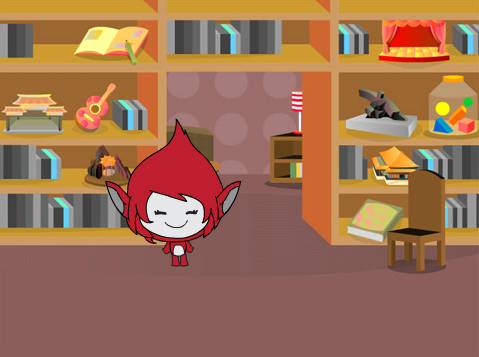

## Vragen maken

Laten we beginnen met het maken van willekeurige vragen die de speler moet beantwoorden.

\--- task \---

Open een nieuw Scratch project.

**Online:** open een nieuw online Scratch project op [rpf.io/scratch-new](http://rpf.io/scratch-new){:target="_blank"}.

**Offline:** open een nieuw project in de offline editor.

Als je de Scratch offline editor wilt downloaden en installeren dan kun je die vinden op [rpf.io/scratchoff](http://rpf.io/scratchoff){:target="_blank"}.

\--- /task \---

\--- task \---

Add a character sprite and a backdrop for your game. You can choose any you like! Here's an example:



\--- /task \---

\--- task \---

Make sure you have your character sprite selected. Create two new variables, called `number 1`{:class="block3variables"} and `number 2`{:class="block3variables"}, to store the numbers for the quiz questions.


[[[generic-scratch3-add-variable]]]

\--- /task \---

\--- task \---

Add code to your character sprite to set both of the `variables`{:class="block3variables"} to a `random`{:class="block3operators"} number between 2 and 12.


```blocks3
wanneer groene vlag wordt aangeklikt
maak [nummer 1 v] (willekeurig getal tussen (2) en (12))
maak [nummer 2 v] (willekeurig getal tussen (2) en (12))
```

\--- /task \---

\--- task \---

Add code to `ask`{:class="block3sensing"} the player for the answer, and then `say for 2 seconds`{:class="block3looks"} whether the answer was right or wrong:


```blocks3
wanneer groene vlag wordt aangeklikt
maak [nummer 1 v] (willekeurig getal tussen (2) en (12))
maak [nummer 2 v] (willekeurig getal tussen (2) en (12))

+ vraag (voeg (nummer 1) en (voeg [ x ] en (nummer 2) samen) samen) en wacht
+ als <(antwoord) = ((nummer 1) * (nummer 2))> dan 
+ zeg [goed! :)] (2) seconden
+ anders
+ zeg [fout :(] (2) sec.
+ einde
```

\--- /task \---

\--- task \---

Test your project twice: answer one question correctly, and the other incorrectly.

\--- /task \---

\--- task \---

Add a `forever`{:class="block3control"} loop around this code, so that the game asks the player lots of questions in a row.

\--- hints \---

\--- hint \---

You need to add a `forever`{:class="block3control"} block, and put all of the code except the `when flag clicked`{:class="block3control"} block into it.

\--- /hint \---

\--- hint \---

Here is the block you need:

```blocks3
herhaal
einde
```

\--- /hint \---

\--- hint \---

Here is what your code should look like:

```blocks3
wanneer groene vlag wordt aangeklikt

+ herhaal
   maak [nummer 1 v] (willekeurig getal tussen (2) en (12))
   maak [nummer 2 v] (willekeurig getal tussen (2) en (12))
   vraag (voeg (nummer 1) en (voeg [ x ] en (nummer 2) samen) samen) en wacht
   als <(antwoord) = ((nummer 1) * (nummer 2))> dan 
     zeg [goed! :)] (2) sec.
    anders
        zeg [fout :(] (2) sec.
    einde
einde
```

\--- /hint \---

\--- /hints \---

\--- /task \---