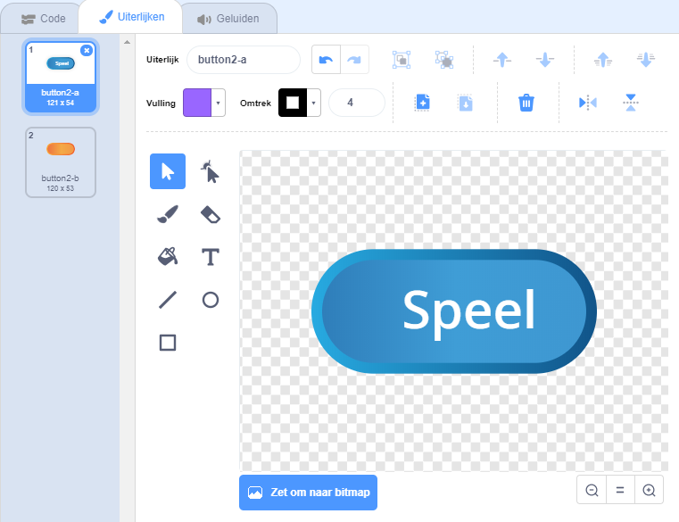
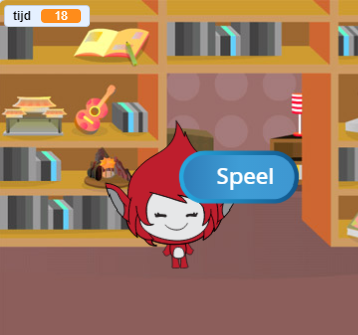

## Meerdere spellen

Nu ga je een 'Speel'-knop toevoegen, zodat de speler je spel heel vaak kan spelen.

--- task --- Maak een nieuwe 'Speel'-knop sprite waarop de speler moet klikken om een nieuw spel te starten.

Je kunt de sprite zelf tekenen, of een sprite bewerken uit de bibliotheek.



--- /task ---

--- task --- Voeg deze code toe aan je knop sprite:


```blocks3
    wanneer groene vlag wordt aangeklikt
  verschijn

  wanneer op deze sprite wordt geklikt
  verdwijn
  zend signaal (start v)
```

--- /task ---

De nieuwe code bevat ook een `zend signaal`{:class="block3events"}-blok, dat het signaal 'start' verzendt.

De nieuwe code zorgt ervoor dat de knop 'Speel' wordt weergegeven als de speler op de vlag klikt. Wanneer de speler op de knop sprite klikt, verbergt de sprite zich en zendt vervolgens een signaal uit waarop andere sprites kunnen reageren.

Op dit moment begint de personage sprite vragen te stellen wanneer de speler op de vlag klikt. Verander de code van je spel zo dat de personage sprite begint vragen te stellen wanneer het het 'start' `zend signaal`{:class="block3events"} ontvangt.

--- task --- Selecteer jouw personage sprite en vervang in de code sectie het `wanneer de groene vlag wordt geklikt`{:class="block3events"} blok met een `wanneer ik signaal start ontvang`{:class="block3events"} blok.


```blocks3
<br />- wanneer groene vlag wordt aangeklikt
+ wanneer ik signaal [start v] ontvang
maak [nummer 1 v] (willekeurig getal tussen (2) en (12))
maak [nummer 2 v] (willekeurig getal tussen (2) en (12))
vraag (voeg (nummer 1) en (voeg [ x ] en (nummer 2) samen) samen) en wacht
als &lt;(antwoord) = ((nummer 1) * (nummer 2))&gt; dan 
  zeg [goed! :)] (2) sec.
anders
  zeg [jammer :(] (2) sec.
end
```

--- /task ---

--- task ---

Klik op de groene vlag en klik vervolgens op de nieuwe knop 'Speel' om te testen of deze werkt. Je zou moeten zien dat het spel niet start voordat je op de knop klikt.

--- /task ---

Is het je opgevallen dat de timer start wanneer op de groene vlag wordt geklikt en niet wanneer het spel begint?



--- task ---

Kun je de code voor de timer zo veranderen dat de timer start wanneer de speler op de knop klikt?

--- /task ---

--- task --- Voeg code toe aan de knop-sprite zodat de knop aan het einde van elk spel opnieuw wordt weergegeven.


```blocks3
    wanneer ik signaal [einde v] ontvang
verschijn
```

--- /task ---

--- task ---

Test de knop 'Speel' door een paar spellen te spelen. De knop moet aan het einde van elk spel worden weergegeven.

Om het spel sneller te testen, kun je de waarde van `tijd`{:class="block3variables"} wijzigen zodat elk spel slechts enkele seconden lang duurt.


```blocks3
    maak [time v] [10]
```

--- /task ---

--- task --- Je kunt eventueel het uiterlijk van de knop veranderen wanneer de muisaanwijzer eroverheen zweeft.


```blocks3
    wanneer groene vlag wordt aangeklikt
  verschijn
  herhaal
    als <touching (mouse-pointer v)?> dan
       zet [vissenoog v] effect op (30)
    anders
       zet [vissenoog v] effect op (0)
    end
 end
```

 --- /task ---