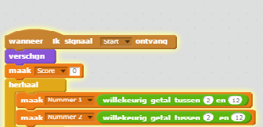
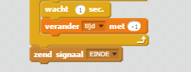

## Meerdere spellen

Laten we een 'speel' knop toevoegen aan je spel, zodat je heel vaak kunt spelen.

+ Maak een nieuwe 'speel'-knop sprite, waarop uw speler zal klikken om een ​​nieuw spel te starten. Je kunt het zelf tekenen of een sprite bewerken vanuit de Scratch-bibliotheek.
    
    

+ Voeg deze code toe aan je nieuwe knop.
    
    ```blocks
    when flag clicked
    show

    when this sprite clicked
    hide
    broadcast [start v]
```

Deze code geeft de afspeelknop weer wanneer uw project is gestart. Wanneer op de knop wordt geklikt, wordt deze verborgen en wordt vervolgens een bericht uitgezonden dat het spel start.

+ Je moet de code van je personage bewerken, zodat het spel start wanneer het ` start ` {: class = "blockevents"} bericht wordt ontvangen, en niet wanneer op de vlag wordt geklikt.
    
    Vervang de ` wanneer op de vlag is geklikt ` {: class = "blockevents"} code met ` wanneer ik start ontvang ` {: Class = "blockevents"}.
    
    

+ Klik op de groene vlag en klik vervolgens op je nieuwe knop om het te testen. Je zou moeten zien dat de game pas start als op de knop wordt geklikt.

+ Is het je opgevallen dat de timer start wanneer op de groene vlag wordt geklikt en niet wanneer het spel begint?
    
    
    
    Kun je dit probleem oplossen?

+ Klik op het werkgebied en vervang de ` stop alles ` {: class = "blockcontrol"} blokkeren met een einde ` ` {: class = "blockevents"} bericht.
    
    

+ Je kunt nu code aan je knop toevoegen om hem aan het eind van elk spel opnieuw te laten zien.
    
    ```blocks
    when I receive [end v]
    show
```

+ Je moet ook voorkomen dat je karakter aan het einde van elk spel nog vragen stelt:
    
    ```blocks
    when I receive [end v]
    stop [other scripts in sprite v]
```

+ Test je afspeelknop door een paar spelletjes te spelen. Je zou moeten opmerken dat de speel-knop na elk spel weer wordt weergegeven. Om het testen gemakkelijker te maken, kun je elke game inkorten, zodat deze maar een paar seconden duurt.
    
    ```blocks
    set [time v] to [10]
```

+ U kunt zelfs wijzigen hoe de knop eruitziet wanneer de muis eroverheen beweegt.
    
    ```blocks
    wanneer ⚑ wordt aangeklikt
verschijn
herhaal
   als <raak ik [muisaanwijzer v]?> dan
      zet [vissenoog v]-effect op (30)
   anders
      zet [vissenoog v]-effect op (0)
   einde
einde
```

