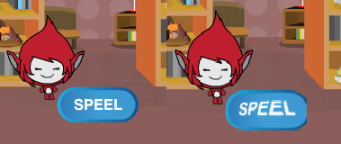

## Meerdere spellen

Nu ga je een 'Speel'-knop toevoegen, zodat de speler je spel heel vaak kan spelen.

\--- task \---

Create a new 'Play' button sprite that the player needs to click to start a new game.

You can draw the sprite yourself, or edit a sprite from the library.


\--- /task \---

\--- task \---

Add this code to your button sprite:


```blocks3
    wanneer groene vlag wordt aangeklikt
  verschijn

  wanneer op deze sprite wordt geklikt
  verdwijn
  zend signaal (start v)
```

\--- /task \---

The new code includes another `broadcast`{:class="block3events"} block, which sends the message 'start'.

The new code makes the 'Play' button sprite show when when player clicks on the flag. When the player clicks on the button sprite, the sprite hides and then broadcasts a message that other sprites can react to.

At the moment, the character sprite starts asking questions when the player clicks the flag. Change your game's code so that character sprite starts asking questions when it receives the 'start' `broadcast`{:class="block3events"}.

\--- task \---

Select your character sprite and, in its code section, replace the `when flag clicked`{:class="block3events"} block with a `when I receive start`{:class="block3events"} block.


```blocks3
<br />- wanneer groene vlag wordt aangeklikt
+ wanneer ik signaal [start v] ontvang
maak [nummer 1 v] (willekeurig getal tussen (2) en (12))
maak [nummer 2 v] (willekeurig getal tussen (2) en (12))
vraag (voeg (nummer 1) en (voeg [ x ] en (nummer 2) samen) samen) en wacht
als <(antwoord) = ((nummer 1) * (nummer 2))> dan 
  zeg [goed! :)] (2) sec.
anders
  zeg [jammer :(] (2) sec.
einde
```

\--- /task \---

\--- task \---

Click the green flag, and then click on the new 'Play' button to test whether it works. You should see that the game doesn't start before you click on the button.

\--- /task \---

Can you see that the timer starts when the green flag is clicked, instead of when the game starts?


\--- task \---

Can you change the code for the timer so that the timer starts when the player clicks on the button?

\--- /task \---

\--- task \---

Add code to your button sprite so that the button shows again at the end of each game.


```blocks3
    wanneer ik signaal [einde v] ontvang
verschijn
```

\--- /task \---

\--- task \---

Test the 'Play' button by playing a couple of games. The button should show at the end of each game.

To test the game more quickly, you can change the value of `time`{:class="block3variables"} so that each game is only a few seconds long.


```blocks3
    maak [tijd v] [10]
```

\--- /task \---

\--- task \---

You can change how the button looks when the mouse pointer hovers over it.


```blocks3
    wanneer groene vlag wordt aangeklikt
  verschijn
  herhaal
    als <raak ik (muisaanwijzer)?> dan
       zet [vissenoog v] effect op (30)
    anders
       zet [vissenoog v] effect op (0)
    einde
 einde
```



\--- /task \---