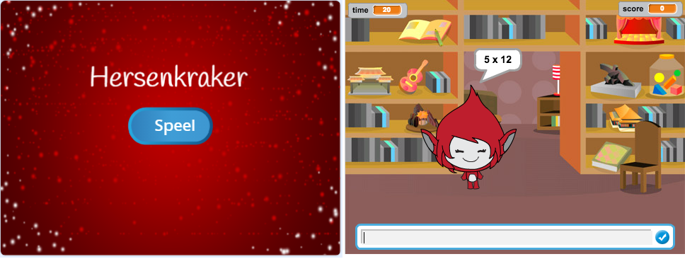

## Uitdaging: maak een startscherm

Kun je nog een achtergrond toevoegen die het startscherm van je spel zal zijn?

Je kunt de `wanneer ik start ontvang`{:class="block3events"} en `wanneer ik einde ontvang`{:class="block3events"} blokken gebruiken om te schakelen tussen de achtergronden.

Om het personage weer te geven of te verbergen wanneer het spel tussen achtergronden schakelt, kun je `verschijn`{:class="block3looks"} en `verdwijn`{:class="block3looks"} blokken gebruiken.

Om de timer en score te tonen of te verbergen wanneer je spel wisselt tussen de achtergronden, kun je `toon variabele`{:class="block3variables"} en `verberg variabele`{:class="block3variables"} blokken gebruiken.

