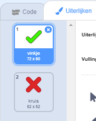
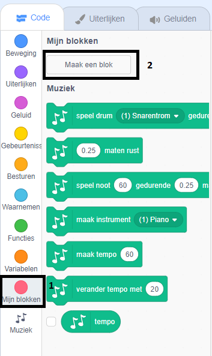

## Afbeeldingen toevoegen

In plaats van dat je alleen maar ` Ja! :) ` of ` nee :( ` zegt tegen de speler, gaan we wat afbeeldingen toevoegen die de speler laten weten hoe ze het doen.

+ Maak een nieuwe sprite met de naam 'Result', die zowel een 'vinkje'- als een 'kruis'-uiterlijk bevat.
    
    

+ Verander de code van je personage, zodat in plaats van de speler te vertellen hoe ze het deden, het ` correct ` {: class = "blockevents"} en ` fout ` {: class = "blockevents"} berichten uitzend.
    
    

+ U kunt deze berichten nu gebruiken om het 'vinkje'- of' kruis'-kostuum te laten zien. Voeg deze code toe aan uw nieuwe 'Result' sprite:
    
    

+ Test je spel opnieuw. Je moet een vinkje zien als je een vraag goed hebt, en een kruisje als je er één fout hebt!
    
    

+ Is het je opgevallen dat de code voor ` wanneer ik correct ontvang ` {: class = "blockevents"} en ` wanneer ik verkeerd ontvang ` {: class = "blockevents"} is bijna identiek? Laten we een functie maken om het gemakkelijker voor u te maken om uw code aan te passen.
    
    Klik op de sprite 'Resultaat' op ` Meer blokken ` {: class = "blockmoreblocks"} en vervolgens 'Maak een blok'. Maak een nieuwe functie met de naam ` animatie ` {: Class = "blockmoreblocks"}.
    
    

+ U kunt dan de animatiecode toevoegen aan uw nieuwe animatiefunctie en vervolgens de functie slechts twee keer gebruiken:
    
    

+ Als u nu het vinkje en het kruisje langer of korter wilt weergeven, hoeft u slechts één wijziging in uw code aan te brengen. Probeer het!

+ In plaats van alleen het vinkje en het kruisje weer te geven en te verbergen, kunt u uw animatiefunctie wijzigen, zodat de grafische elementen vervagen.
    
    ```blocks
    definieer [animate]
zet [geest v]-effect op (100)
verschijn
herhaal (25) keer
   verander [geest v]-effect met (-4)
einde
verdwijn
```