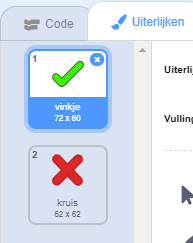
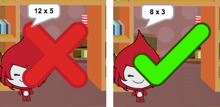
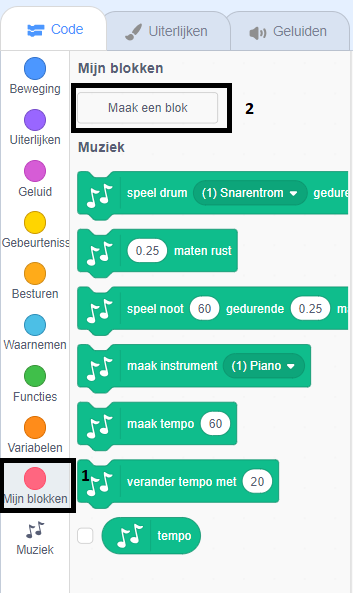
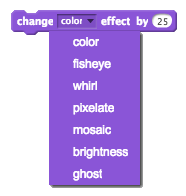

## Afbeeldingen toevoegen

Op dit moment zegt de personage-sprite gewoon `goed! :)` of `fout :(` op de antwoorden van de speler. Voeg wat grafische afbeeldingen toe om de speler te laten weten of hun antwoord goed of fout is.

--- task ---

Maak een nieuwe sprite met de naam 'Resultaat', die zowel een 'vinkje'- als een 'kruis'-uiterlijk bevat.



--- /task ---

--- task ---

Wijzig de code van je personage-sprite zodat, in plaats van iets tegen de speler te zeggen, het een `zend signaal`{:class="block3events"} 'goed' of 'fout' verstuurt.


```blocks3
if <(answer) = ((nummer 1) * (nummer 2))> then 
- say [goed! :)] for (2) seconds
+ broadcast (goed v)
else 
- say [jammer :(] for (2) seconds
+ broadcast (fout v)
end
```

--- /task ---

--- task ---

Nu kun je deze signalen gebruiken om het 'vinkje'- of 'kruis'-uiterlijk te kiezen bij `verander uiterlijk naar`{:class="block3looks"}. Voeg de volgende code toe aan de sprite 'Resultaat':


```blocks3
when I receive [goed v]
switch costume to (vinkje v)
show
wait (1) seconds
hide

when I receive [fout v]
switch costume to (kruis v)
show
wait (1) seconds
hide

when flag clicked
hide
```

--- /task ---

--- task --- Test je spel opnieuw. Je moet een vinkje zien als je een vraag goed hebt, en een kruisje als je er één fout hebt!



--- /task ---

Is het je opgevallen dat de code voor `wanneer ik signaal goed ontvang`{:class="block3events"} en `wanneer ik signaal fout ontvang`{:class="block3events"} bijna identiek is?

Om de code gemakkelijker te kunnen wijzigen, gaan we een zelfgeschreven blok maken.

--- task ---

Selecteer de 'Resultaat' sprite. Klik vervolgens op `Mijn blokken`{:class ="block3myblocks"} en vervolgens op **Maak een blok**. Maak een nieuw blok en noem het `animatie`{:class="block3myblocks"}.




--- /task ---

--- task --- Verplaats de code van `verschijn`{:class="block3looks"} en `verdwijn`{:class="block3looks"} van de 'Resultaat' sprite naar het `animatie`{:class="block3myblocks"} blok:


```blocks3
define animatie
show
wait (1) seconds
hide
```

--- /task ---

--- task --- Zorg ervoor dat je de `verschijn`{:class="block3looks"} en `verdwijn`{:class="block3looks"} blokken onder **beide** `veranderlijk uiterlijk`{:class="block3looks"} blokken hebt verwijderd.

Voeg vervolgens het `animatie`{:class="block3looks"} blok toe aan beide `verander uiterlijk`{:class="block3looks"} blokken. Je code moet er nu zo uitzien:


```blocks3
when I receive [goed v]
switch costume to (vinkje v)
animatie:: custom

when I receive [fout v]
switch costume to (kruis v)
animatie:: custom
```

--- /task ---

Vanwege het zelfgemaakte `animatie`{:class="block3myblocks"} blok, hoef je nu slechts één wijziging in de code te maken als je de uiterlijken van de 'Resultaat' sprite langer of korter wilt laten zien.

--- task ---

Wijzig je code zó dat het 'vinkje'- of 'kruis'-uiterlijk wordt weergegeven gedurende 2 seconden.

--- /task ---

--- task --- In plaats van `verschijn`{:class="block3looks"} en `verdwijn`{:class="block3looks"} van het 'vinkje'- of 'kruis'-uiterlijk, zou je het `animatie`{:class="block3myblocks"} blok kunnen veranderen zodat de kostuums langzaam verschijnen.


```blocks3
define animatie
set [geest v] effect to (100)
show
repeat (25) 
  change [geest v] effect by (-4)
end
hide
```

--- /task ---

Kun je de animatie van de 'vinkje'- of' 'kruis'-afbeelding verbeteren? Je zou code kunnen toevoegen om de uiterlijken te laten vervagen, of je zou andere coole effecten kunnen gebruiken:

