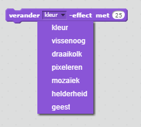

## Afbeeldingen toevoegen

Op dit moment zegt de personage-sprite gewoon `goed! :)` of `fout :(` op de antwoorden van de speler. Voeg wat grafische afbeeldingen toe om de speler te laten weten of hun antwoord goed of fout is.

--- task ---

Maak een nieuwe sprite met de naam 'Resultaat', die zowel een 'vinkje'- als een 'kruis'-uiterlijk bevat.


--- /task ---

--- task ---

Wijzig de code van je personage-sprite zodat, in plaats van iets tegen de speler te zeggen, het een `zend signaal`{:class="block3events"} 'goed' of 'fout' verstuurt.


```blocks3
als <(antwoord) = ((nummer 1) * (nummer 2))> dan

- zeg [goed! :)] (2) sec.
+ zend signaal (goed v)
anders
- zeg [jammer :(] (2) sec.
+ zend signaal (fout v)
end
```

--- /task ---

--- task ---

Nu kun je deze signalen gebruiken om het 'vinkje'- of 'kruis'-uiterlijk te kiezen bij `verander uiterlijk naar`{:class="block3looks"}. Voeg de volgende code toe aan de sprite 'Resultaat':


```blocks3
    wanneer ik signaal [goed v] ontvang
    verander uiterlijk naar (vinkje v)
    verschijn
    wacht (1) sec.
    verdwijn

 wanneer ik signaal [fout v] ontvang
    verander uiterlijk naar (kruis v)
    verschijn
    wacht (1) sec.
    verdwijn

  wanneer op groene vlag wordt geklikt
    verdwijn
```

--- /task ---

--- task --- Test je spel opnieuw. Je moet een vinkje zien als je een vraag goed hebt, en een kruisje als je er één fout hebt!


--- /task ---

Is het je opgevallen dat de code voor `wanneer ik signaal goed ontvang`{:class="block3events"} en `wanneer ik signaal fout ontvang`{:class="block3events"} bijna identiek is?

Om de code gemakkelijker te kunnen wijzigen, gaan we een zelfgeschreven blok maken.

--- task ---

Selecteer de 'Resultaat' sprite. Klik vervolgens op `Mijn blokken`{:class ="block3myblocks"} en vervolgens op **Maak een blok**. Maak een nieuw blok en noem het `animatie`{:class="block3myblocks"}.


--- /task ---

--- task --- Verplaats de code van `verschijn`{:class="block3looks"} en `verdwijn`{:class="block3looks"} van de 'Resultaat' sprite naar het `animatie`{:class="block3myblocks"} blok:


```blocks3
definieer animatie
verschijn
wacht (1) sec.
verdwijn
```

--- /task ---

--- task --- Zorg ervoor dat je de `verschijn`{:class="block3looks"} en `verdwijn`{:class="block3looks"} blokken onder **beide** `veranderlijk uiterlijk`{:class="block3looks"} blokken hebt verwijderd.

Voeg vervolgens het `animatie`{:class="block3myblocks"} blok toe aan beide `verander uiterlijk`{:class="block3looks"} blokken. Je code moet er nu zo uitzien:


```blocks3
    wanneer ik signaal [goed v] ontvang
    verander uiterlijk naar (vinkje v)
    animatie

wanneer ik signaal [fout v] ontvang
    verander uiterlijk naar (kruis v)
    animatie
```

--- /task ---

Vanwege het zelfgemaakte `animatie`{:class="block3myblocks"} blok, hoef je nu slechts één wijziging in de code te maken als je de uiterlijken van de 'Resultaat' sprite langer of korter wilt laten zien.

--- task ---

Wijzig je code zó dat het 'vinkje'- of 'kruis'-uiterlijk wordt weergegeven gedurende 2 seconden.

--- /task ---

--- task --- In plaats van `verschijn`{:class="block3looks"} en `verdwijn`{:class="block3looks"} van het 'vinkje'- of 'kruis'-uiterlijk, zou je het `animatie`{:class="block3myblocks"} blok kunnen veranderen zodat de kostuums langzaam verschijnen.


```blocks3
    definieer animatie
  zet [geest v] effect op (100)
  verschijn
  herhaal (25)
    verander [geest v] effect met (-4)
  end
  verdwijn
```

--- /task ---

Kun je de animatie van de 'vinkje'- of' 'kruis'-afbeelding verbeteren? Je zou code kunnen toevoegen om de uiterlijken te laten vervagen, of je zou andere coole effecten kunnen gebruiken:

