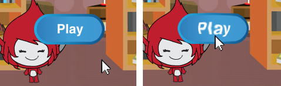

## Flere spill

Nå skal du legge til en "Play" -knapp, slik at spilleren kan spille spillet mange ganger.

\--- Oppgave \--- Opprett en ny 'Spill' -knapp som spilleren må klikke for å starte et nytt spill.

Du kan tegne sprite selv, eller redigere et sprite fra biblioteket.


\--- / oppgave \---

\--- oppgave \--- Legg denne koden til din knappesprite:


```blocks3
    når flagget klikket
    viser

    når denne sprite klikket
    skjul
    send (start v)
```

\--- / oppgave \---

Den nye koden inneholder en annen `kringkasting`{: class = "block3events"} blokk, som sender meldingen 'start'.

Den nye koden gjør Sprite-showet "Play" -knappen når når spilleren klikker på flagget. Når spilleren klikker på knappens sprite, skjuler sprite og sender en melding som andre sprites kan reagere på.

For øyeblikket begynner tegnsporet å stille spørsmål når spilleren klikker på flagget. Endre spillets kode, slik at tegnsprite begynner å stille spørsmål når den mottar "start" `sendingen`{: class = "block3events"}.

\--- oppgave \--- Velg din karaktersprite og erstatt `når flagget klikket`{: class = "block3events"} blokk med en `når jeg mottar start`{: class = "block3events" } blokk.


```blocks3
<br />- når flagget klikket
+ når jeg mottar [start v]
sett [nummer 1 v] til (velg tilfeldig (2) til (12))
sett [nummer 2 v] til (velg tilfeldig (2) til (12) )
spør (bli nummer 1) (bli med [x] (nummer 2))) og vent
hvis &lt;(svar) = ((nummer 1) * (nummer 2))&gt; så
    si [ja! :)] for (2) sekunder
annet
    si [nope :(] for (2) sekunder
ende
```

\--- / oppgave \---

\--- oppgave \---

Klikk på det grønne flagget, og klikk deretter på den nye "Spill" -knappen for å teste om det virker. Du bør se at spillet ikke starter før du klikker på knappen.

\--- / oppgave \---

Kan du se at timeren starter når det grønne flagget klikkes, i stedet for når spillet starter?


\--- oppgave \---

Kan du endre koden for timeren slik at timeren starter når spilleren klikker på knappen?

\--- / oppgave \---

\--- oppgave \--- Legg til kode på knappens sprite slik at knappen viser igjen på slutten av hvert spill.


```blocks3
    når jeg mottar [end v]
    show
```

\--- / oppgave \---

\--- oppgave \---

Test "Play" -knappen ved å spille et par spill. Knappen skal vises på slutten av hvert spill.

For å teste spillet raskere, kan du endre verdien av `time`{: class = "block3variables"} slik at hvert spill er bare noen sekunder lang.


```blocks3
    sett [tid v] til [10]
```

\--- / oppgave \---

\--- oppgave \--- Du kan endre hvordan knappen ser ut når musemarkøren svinger over den.


```blocks3
    når flagget klikket
    vis
    alltid
    hvis <touching (mouse-pointer v)?> så
        sett [fisheye v] effekt til (30)
    annet
        sett [fisheye v] effekt til (0)
    ende
    ende
```

 \--- / oppgave \---