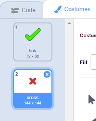

## Legg til grafikk

For øyeblikket sier karaktersprite bare `ja! :)` eller `no :(` til spillerens svar. Legg til litt grafikk for å la spilleren vite om svaret deres er riktig eller feil.

\--- oppgave \---

Opprett en ny sprite som heter 'Resultat', og gi den en 'tick / check' og en 'cross' kostyme.



\--- / oppgave \---

\--- oppgave \---

Endre karakterskiltens kode slik at, i stedet for å si noe til spilleren, sender ``{: class = "block3events"} meldingene "riktig" eller "feil".


```blocks3
hvis <(svar) = ((nummer 1) * (nummer 2))> deretter

- si [ja! :)] for (2) sekunder
+ kringkasting (riktig v)
andre
- si [nope :(] for (2) sekunder
+ kringkasting (feil v)
ende
```

\--- / oppgave \---

\--- oppgave \---

Nå kan du bruke disse meldingene til `vise`{: class = "block3looks"} 'tick' eller 'cross' kostyme. Legg til følgende kode i resultatruten:


```blocks3
    når jeg mottar [feil v]
    byttekostyme til (kryss v)
    vis
    vent (1) sekunder
    skjul

    når jeg mottar [feil v]
    bryter kostyme til (kryss v)
    vis
    vente (1) sekunder
    skjul

    når flagget klikket
    skjul
```

\--- / oppgave \---

\--- task \---

Test your game again. You should see the tick whenever you answer a question correctly, and the cross whenever you answer incorrectly!


\--- /task \---

Can you see that the code for `when I receive correct`{:class="block3events"} and `when I receive wrong`{:class="block3events"} is nearly identical?

So you can change your code more easily, you are going to create a custom block.

\--- task \---

Select the 'Result' sprite. Then click on `My Blocks`{:class="block3myblocks"}, and then on **Make a Block**. Create a new block and call it `animate`{:class="block3myblocks"}.


\--- /task \---

\--- task \---

Move the code to `show`{:class="block3looks"} and `hide`{:class="block3looks"} the 'Result' sprite into the `animate`{:class="block3myblocks"} block:


```blocks3
definer animere
vis
vent (1) sekunder
skjul
```

\--- /task \---

\--- task \---

Make sure you have removed the `show`{:class="block3looks"} and `hide`{:class="block3looks"} blocks below **both** of the `switch costume`{:class="block3looks"} blocks.

Then add the `animate`{:class="block3myblocks"} block below both of the `switch costume`{:class="block3looks"} blocks. Your code should now look like this:


```blocks3
    når jeg mottar [korrekt v]
    byttekostyme til (kryss v)
    animate :: tilpasset

    når jeg mottar [feil v]
    byttekostyme til (kryss v)
    animere :: tilpasset
```

\--- /task \---

Because of the custom `animate`{:class="block3myblocks"} block, you now only need to make one change to your code if you want to show the 'Result' sprite's costumes a longer or shorter time.

\--- task \---

Change your code so that the 'tick' or 'cross' costumes display for 2 seconds.

\--- / oppgave \---

\--- task \---

Instead of `showing`{:class="block3looks"} and `hiding`{:class="block3looks"} the 'tick' or 'cross' costumes, you could change your `animate`{:class="block3myblocks"} block so that the costumes fade in.


```blocks3
    definer animere
    sett [spøkelse v] effekt til (100)
    vis
    gjenta (25)
        endre [spøkelse v] effekt av (-4)
    ende
    skjul
```

\--- /task \---

Can you improve the animation of the 'tick' or 'cross' graphics? You could add code to make the costumes fade out as well, or you could use other cool effects:

