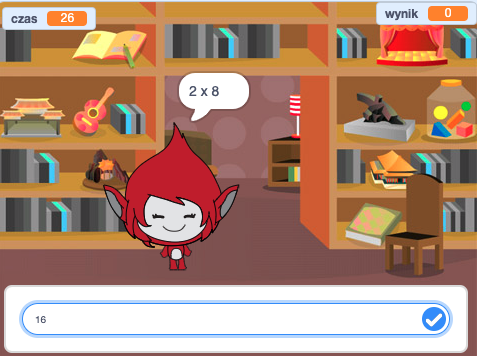

## Wprowadzenie

W ramach tego projektu dowiesz się jak stworzyć quiz z tabliczki mnożenia, w którym trzeba poprawnie odpowiedzieć na maksymalną ilość pytań w 30 sekund.

  <iframe allowtransparency="true" width="485" height="402" src="https://scratch.mit.edu/projects/embed/42225768/?autostart=false" frameborder="0"></iframe>
  

### Dodatkowe informacje dla prowadzących klub

Jeśli potrzebujesz wydrukować ten projekt, skorzystaj z [Wersji dla drukarek](https://projects.raspberrypi.org/en/projects/brain-game/print).

## \--- zminimalizuj \---

## tytuł: Notatki prowadzącego klub

## Wprowadzenie:

W ramach tego projektu, dzieci nauczą się jak stworzyć grę na temat tabliczki mnożenia, w której gracze mają poprawnie odpowiedzieć na maksymalną ilość pytań w 30 sekund.

## Zasoby

Do tego projektu należy użyć Scratch 2. Scratch 2 można używać w internecie pod [jumpto.cc/scratch-on](http://jumpto.cc/scratch-on) lub też pobrać z [jumpto.cc/scratch-off](http://jumpto.cc/scratch-off) dla celów offline.

Ukończoną wersję tego projektu można znaleźć [online](http://scratch.mit.edu/projects/42225768/#editor) lub też można ją pobrać klikając w link 'Materiały Projektu' w tym projekcie, który zawiera:

* BrainGame.sb2

## Cele kształcenia

* This project consolidates learning of previous programming skills learnt, and shows how broadcasts can be used to create a simple game menu system.

This project covers elements from the following strands of the [Raspberry Pi Digital Making Curriculum](http://rpf.io/curriculum):

* [Combine programming constructs to solve a problem.](https://www.raspberrypi.org/curriculum/programming/builder)

## Challenges

* "Changing costumes" - changing how the game character looks in response to correct and incorrect answers;
* "Adding a score" - adding a point for every correct question answered;
* "Start screen" - changing the stage backdrop in response to the `start`{:class="blockevents"} and `end`{:class="blockevents"} broadcast messages, creating 2 game 'screens';
* "Improved animation" - using loops and effects to improve the correct/wrong graphics animation;
* "Sound and music" - consolidating learning of music loops and sound effects;
* "Race to 10 points" - changing the game logic to create a new game objective;
* "Instruction screen" - consolidating the use of broadcasts to create a game menu, by adding a new 'instructions' button and screen.

\--- /collapse \---

## \--- collapse \---

## title: Project materials

## Club leader resources

* [Downloadable completed Scratch 2 project](resources/BrainGame.sb2)
* [Online completed Scratch 2 project](http://scratch.mit.edu/projects/42225768/#editor)

\--- /collapse \---