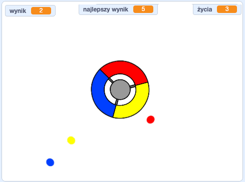

## Co dalej?

Przejdź do projektu pt. [Złap kropki](https://projects.raspberrypi.org/pl-PL/projects/catch-the-dots?utm_source=pathway&utm_medium=whatnext&utm_campaign=projects), żeby stworzyć grę reakcyjną! W tym projekcie nauczysz się, jak tworzyć klony duszków i jak używać zmiennej, aby stopniowo przyśpieszyć grę.

--- no print --- Użyj klawiszy strzałek na klawiaturze, aby obrócić pokrętło kontrolera i złapać latające kropki, gdy docierają do środka. Jeśli przegapisz trzy kropki, gra się kończy.

  <iframe allowtransparency="true" width="485" height="402" src="https://scratch.mit.edu/projects/embed/342814426/?autostart=false" frameborder="0" scrolling="no"></iframe>
  

--- /no-print ---

--- print-only ---  --- /print-only ---

**Tłumaczenie wykonane przez wolontariuszy**

Projekt ten przetłumaczył **Marek Lubinski**/**Paweł Wilk** a zweryfikował **Karol Gajowniczek**.

Dzięki naszym wspaniałym wolontariuszom, ludzie na całym świecie mogą nauczyć się kodowania. Tłumacząc nasze projekty możesz pomóc nam dotrzeć do większej liczby ludzi. Więcej informacji na stronie [rpf.io/translate](https://rpf.io/translate).