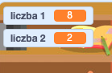

## Tworzenie pytań

Zacznijmy od stworzenia losowych pytań, na które gracz odpowie.

+ Otwórz nowy projekt Scratch i usuń obrazek kota, aby twój projekt był pusty. Możesz użyć edytor Scratch online pod adresem <a href="http://jumpto.cc/scratch-new" target="_blank"> jumpto.cc/scratch-new </a>.

+ Wybierz postać i tło dla swojej gry. Możesz wybrać, co chcesz! Na przykład:
    
    

+ Utwórz 2 nowe zmienne o nazwie `numer 1`{:class="blockdata"} i `numer 2`{:class="blockdata"}. Te zmienne przechowują 2 liczby, które będą mnożone razem.
    
    

+ Dodaj kod do swojej postaci, aby ustawić obie te zmienne na `losuj`{:class="blockoperators"} od 2 do 12.
    
    ```blocks
        kiedy kliknięto zieloną flagę
    ustaw [numer 1 v] na (losuj od (2) do (12))
    ustaw [numer 2 v] na (losuj od (2) do (12))
    ```

+ Następnie możesz poprosić gracza o odpowiedź i dać im znać, czy są poprawne, czy nie.
    
    ```blocks
        kiedy kliknięto zieloną flagę
    ustaw [numer 1 v] na (losuj od (2) do (12))
    ustaw [numer 2 v] na (losuj od (2) do (12))
    zapytaj (połącz (numer 1) i (połącz [ x ] i (numer 2))) i czekaj
    jeżeli <(odpowiedz) = ((numer 1) * (numer 2))> to 
      powiedz [zgadza się! :)] przez (2) s
      powiedz [nie bardzo :(] przez (2) s
    end
    ```

+ Sprawdź swój projekt dokładnie, odpowiadając jedno na pytanie poprawnie i na jedno podając błędną odpowiedź.

+ Dodaj pętlę `zawsze`{:class="blockcontrol"} dookoła tego kodu, żeby zadawać graczowi mnóstwo pytań.

+ Utwórz zegar odliczający czas na scenie, używając zmiennej o nazwie `czas`{:class="blockdata"}. Projekt "Ghostbusters" zawiera instrukcje dotyczące tworzenia timera (w punkcie 5), jeśli potrzebujesz pomocy!

+ Ponownie przetestuj swój projekt - powinieneś móc zadawać pytania, aż skończy się czas.