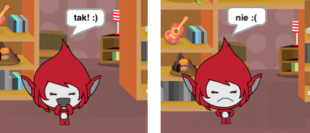

## Wyzwanie: dodaj ocenę i reakcje

Czy możesz dodać wynik do swojej gry?

Możesz dodać kod, aby gracz uzyskał punkt za każdą poprawną odpowiedź. Jeśli masz na myśli, możesz także dodać kod, aby zresetować wynik gracza do zera, jeśli dostaniesz złą odpowiedź!

[[[generic-scratch3-high-score]]]

Czy potrafisz sprawić, by twoja postać reagowała na odpowiedź gracza, zmieniając kostium na inny, jeśli odpowiedź jest poprawna lub niepoprawna?

