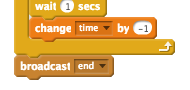

## Wielokrotne gry

Dodajmy do gry przycisk "Zagraj", żeby móc zagrać wiele razy.

+ Stwórz nowy duszek przycisku "Zagraj", którą gracz kliknie, aby rozpocząć nową grę. Możesz narysować go samodzielnie lub edytować obraz z biblioteki Scratch.
    
    

+ Dodaj ten kod do nowego przycisku.
    
    ```blocks
        kiedy kliknięto zieloną flagę
    pokaż
    
    kiedy duszek kliknięty
    ukryj
    nadaj [start v]
    ```
    
    Ten kod pokazuje przycisk "Zagraj" po uruchomieniu projektu. Po kliknięciu przycisku jest on ukrywany, a następnie nadajemy komunikat, który uruchomi grę.

+ Będziesz musiał edytować kod swojej postaci, aby gra zaczęła się, gdy otrzymasz komunikat `start`{:class="blockevents"}, a nie po kliknięciu flagi.
    
    Zamień `kiedy kliknięto zieloną flagę`{:class="blockevents"} na `kiedy otrzymam [start v]`{:class="blockevents"}.
    
    

+ Kliknij zieloną flagę, a następnie kliknij nowy przycisk odtwarzania, aby go przetestować. Powinieneś zobaczyć, że gra nie rozpocznie się, dopóki przycisk nie zostanie kliknięty.

+ Czy zauważyłeś, że licznik czasu zaczyna się po kliknięciu zielonej flagi, a nie po rozpoczęciu gry?
    
    
    
    Czy możesz rozwiązać ten problem?

+ Click on the stage, and replace the `stop all`{:class="blockcontrol"} block with an `end`{:class="blockevents"} message.
    
    

+ You can now add code to your button, to show it again at the end of each game.
    
    ```blocks
        when I receive [end v]
        show
    ```

+ You'll also need to stop your character asking questions at the end of each game:
    
    ```blocks
        when I receive [end v]
        stop [other scripts in sprite v]
    ```

+ Test your play button by playing a couple of games. You should notice that the play button shows after each game. To make testing easier, you can shorten each game, so that it only lasts a few seconds.
    
    ```blocks
        set [time v] to [10]
    ```

+ You can even change how the button looks when the mouse hovers over it.
    
    ```blocks
        when flag clicked
        show
        forever
        if <touching [mouse-pointer v]?> then
            set [fisheye v] effect to (30)
        else
            set [fisheye v] effect to (0)
        end
        end
    ```
    
    