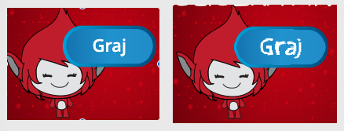

## Wielokrotne gry

Teraz masz zamiar dodać przycisk "Graj", aby gracz mógł grać w grę wiele razy.

\--- task \--- Utwórz nową ikonkę przycisku "Graj", którą gracz musi kliknąć, aby rozpocząć nową grę.

Możesz samemu narysować sprite'a lub edytować duszek z biblioteki.


\--- /task \---

\--- task \--- Dodaj ten kod do swojego sprite przycisku:


```blocks3
    kiedy flaga kliknęła
    pokaż

    kiedy ten duszek kliknął
    ukryj
    transmisje (start v)
```

\--- /task \---

Nowy kod zawiera kolejny blok `broadcast`{: class = "block3events}}, który wysyła komunikat" start ".

Nowy kod sprawia, że ikonka "Graj" pojawia się, gdy gracz kliknie flagę. Kiedy gracz kliknie na ikonkę przycisku, sprite ukrywa, a następnie nadaje komunikat, na który mogą reagować inne sprite'y.

W tej chwili sprite znaków zaczyna zadawać pytania, gdy gracz kliknie flagę. Zmień kod swojej gry, aby sprite postaci zaczynał zadawać pytania, gdy otrzyma komunikat "start" ``{: class = "block3events"}.

\--- zadanie \--- Wybierz swoją postać i sprite w swojej sekcji kodu, wymienić `po kliknięciu flagi`{: class = "block3events"} blok z `kiedy zacząć odbierać`{: class = "block3events" } blokuj.


```blocks3
<br />- kiedy flaga kliknęła
+ kiedy otrzymam [start v]
ustaw [numer 1 v] na (wybierz losowo (2) do (12))
ustaw [numer 2 v] na (wybierz losowo (2) do (12) )
zapytaj (dołącz (numer 1) (dołącz [x] (numer 2)) i poczekaj
jeśli &lt;(odpowiedź) = ((numer 1) * (numer 2))&gt; a następnie
    powiedz [tak! :)] przez (2) sekundy
jeszcze
    powiedz [nope :(] przez (2) sekundy
koniec
```

\--- /task \---

\--- task \---

Kliknij zieloną flagę, a następnie kliknij przycisk "Odtwórz", aby sprawdzić, czy działa. Powinieneś zobaczyć, że gra nie uruchamia się, zanim klikniesz przycisk.

\--- /task \---

Czy widzisz, że licznik czasu zaczyna się po kliknięciu zielonej flagi, a nie po uruchomieniu gry?


\--- task \---

Czy możesz zmienić kod timera tak, aby timer zaczął się, gdy gracz kliknie przycisk?

\--- /task \---

\--- task \--- Dodaj kod do sprite'a na przycisk, aby przycisk pojawiał się ponownie na końcu każdej gry.


```blocks3
    kiedy otrzymam [koniec v]
pokaż
```

\--- /task \---

\--- task \---

Przetestuj przycisk "Graj", grając w kilka gier. Przycisk powinien pojawić się na końcu każdej gry.

Aby szybciej przetestować grę, możesz zmienić wartość `raz`{: class = "block3variables"}, aby każda gra trwała tylko kilka sekund.


```blocks3
    ustaw [czas v] na [10]
```

\--- /task \---

\--- task \--- Możesz zmienić sposób wyświetlania przycisku, gdy wskaźnik myszy najedzie na niego.


```blocks3
    kiedy kliknięto zieloną flagę
pokaż
zawsze 
  jeżeli <touching (mouse-pointer v)?> to 
    ustaw efekt [rybie oko v] na (30)
 w przeciwnym razie
    ustaw efekt [rybie oko v] na (0)
  end
end
```

 \--- /task \---