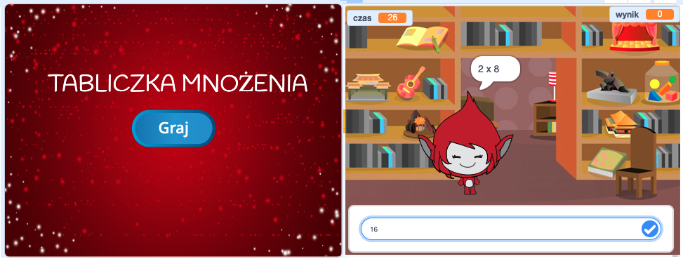

\--- challenge \---

## Wyzwanie: ekran startowy

Czy możesz dodać kolejne tło do swojej sceny, które stanie się ekranem startowym Twojej gry? Możesz użyć bloków `kiedy otrzymam [start v]`{:class="blockevents"} i0 `kiedy otrzymam [koniec v]`{:class="blockevents"} aby przełączyć się między tłami.

Możesz także pokazać i ukryć swoją postać, a nawet pokazać i ukryć swój zegar, używając tych bloków:

```blocks
pokaż zmienną [czas v]
```

```blocks
ukryj zmienną [czas v]
```



\--- /challenge \---