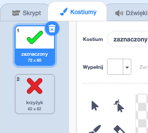

## Dodawanie grafiki

Zamiast twojej postaci, mówiącej graczowi tylko `tak!:)` lub `nie :(`, dodajmy trochę grafiki, która pozwoli graczowi dowiedzieć się, jak sobie radzi.

+ Stwórz nowego duszka o nazwie "Wynik", zawierający zarówno strój "haczyka", jak i "krzyżyk".
    
    

+ Zmień kod swojej postaci, aby zamiast mówić graczowi, jak oni to zrobili, nadaje `correct`{:class="blockevents"} i `wrong`{:class="blockevents"}.
    
    

+ Możesz teraz używać tych wiadomości, aby pokazać kostium "haczyka" lub "krzyżyka". Dodaj ten kod do nowego duszka "Wynik":
    
    

+ Sprawdź swoją grę ponownie. Powinieneś zobaczyć haczyk, gdy uzyskasz poprawne pytanie, i krzyżyk za każdym razem, gdy popełnisz błąd!
    
    

+ Czy zauważyłeś, że kod dla `kiedy otrzymam correct`{:class="blockevents"} i `kiedy otrzymam wrong`{:class="blockevents"} jest prawie identyczny? Stwórzmy funkcję, która ułatwi wprowadzanie zmian w kodzie.
    
    Na ikonce "Wynik" kliknij przycisk `Więcej bloków`{:class="blockmoreblocks"}, a następnie "Utwórz blok". Utwórz nową funkcję o nazwie `animate`{:class="blockmoreblocks"}.
    
    

+ Następnie możesz dodać kod animacji do swojej nowej funkcji animacji, a następnie po prostu użyj tej funkcji dwa razy:
    
    

+ Teraz, jeśli chcesz pokazać tick i krzyżyk przez dłuższy lub krótszy czas, wystarczy wprowadzić jedną zmianę w kodzie. Spróbuj!

+ Zamiast pokazywać i ukrywać tyknięcie i krzyżyk, możesz zmienić funkcję animacji, aby grafika rozmywała się.
    
    ```blocks
        define [animate]
        set [ghost v] effect to (100)
        show
        repeat (25)
            change [ghost v] effect by (-4)
        end
        hide
    ```